\usepackage{color}
\usepackage{amsmath} 
\color{#B6854D}{\text{}}{-}

```{=html}
<style type="text/css">
body {
text-align: justify;
font-style: normal;
font-family: "Montserrat";
font-size: 12px
}
h1.title {
  font-size: 40px;
  color: #1C3BA4;
}
h1 {
  color: #B6854D;
}
h2 {
  color: #172984;
}
h3 {
  color: #172984;
}
h5 {
  color: #B6854D;
}
</style>
```

```{=html}
<style>
.nav>li>a {
    position: relative;
    display: block;
    padding: 10px 15px;
    color: #1C3BA4
}
.nav-pills>li.active>a, .nav-pills>li.active>a:hover, .nav-pills>li>a:focus {
    color: #ffffff;
    background-color: #09C2BC
}
</style>
```

```{=html}
<style>
.tile1-text {
    position: relative;
    display: block;
    padding: 10px 15px;
    color: #0A6A87;
    list-style: none;
}
.top1-tiles a:nth-of-type(1):hover, .top-tiles1 a:nth-of-type(1):focus{
    color: #ffffff;
    background: #0A6A87
}

.tile2-text {
    position: relative;
    display: block;
    padding: 10px 15px;
    color: #0A6CC8;
    list-style: none;
}
</style>
```

```{=html}
<style>
.math {
  font-size: 15px;
  color: #B6854D;
}
</style>
```


```{r setup, include=FALSE}
knitr::opts_chunk$set(echo = TRUE, message = FALSE, warning = FALSE, cache = TRUE, cache.lazy = FALSE, collapse = TRUE, 
                      #class.source = "fold-hide",
                      eval = FALSE
                      )
```

```{r,echo = FALSE, eval = FALSE}
rm(list = ls())
```

```{r, echo = FALSE, results=FALSE}
# Se descargan las fuentes de la google fonts
require(showtext)
library(extrafont)
# activar showtext
windowsFonts()
```

```{r, echo = FALSE, results=FALSE, eval = TRUE}
require(dplyr)          #A Grammar of Data Manipulation 
require(forcats)        #Tools for Working with Categorical Variables (Factors)
require(ggplot2)        # Generar gráficos ggplot y la geometría de un mapa
require(ggthemes)       # Extra Themes, scale and Geoms for ggplot2
require(ggmap)          #Spatial Visualization with ggplot2 
require(ggpubr)         #Based Publication Ready Plots with ggplot2
require(knitr)
require(kableExtra)
require(lubridate)
require(openxlsx)
require(readxl)
require(RColorBrewer)   #ColorBrewer Palettes 
require(rgdal)          #Para importar shapefiles. 
require(sp)             # Classes and Methos for Spatial Data
require(spdplyr)        #Data manipulation verbs for the sptial classes
require(tidyverse) 
require(tinytex)
require(tmap)
require(tmaptools)
require(tibble)
require(unikn)          # Paleta de colores
require(viridisLite)    # Paleta de colores 
require(doMC)            # Foreach Parallel Adaptor for 'parallel'  
registerDoMC(cores = 16)   # 
memory.size()
invisible(utils::memory.limit(size = 60000000))
#tinytex::install_tinytex()  # Esto instala un motor LaTeX completo
```

```{r, echo = FALSE, eval = TRUE, cache=TRUE}
# Se cargan las bases de datos generadas en el documento
archivo <- c("shape", "capas", "layer", "tbl")
nivel <- c("estados", "municipios", "localidad", "localidad_p", "ageb")
for(i in 1:4){
  for(j in 1:5){
    assign(paste0(archivo[i], "_", nivel[j]), readRDS(file = paste0(here::here(), "/Output/", archivo[i], "_", nivel[j], ".RDS")))
  }
}
capas_zm <- readRDS(file = paste0(here::here(), "/Output/capas_zm.RDS"))
load(file = paste0(here::here(), "/Output/IME_2020.RData"))
load(file = paste0(here::here(), "/Output/IMM_2020.RData"))
load(file = paste0(here::here(), "/Output/IML_2020.RData"))
load(file = paste0(here::here(), "/Output/IMU_2020.RData"))
load(file = paste0(here::here(), "/Output/ZM_2020.RData"))
```


# Objetivo

Se presenta una metodología para el análisis cartográfico digital utilizando `R`, implementando diversas bibliotecas que integran funcionalidades geográficas y estadísticas. El objetivo es facilitar la visualización y el modelado de datos geoespaciales mediante software de código abierto, con énfasis en la aplicación de Sistemas de Información Geográfica (`SIG`) para el análisis de datos georreferenciados. 


<p align="center">
  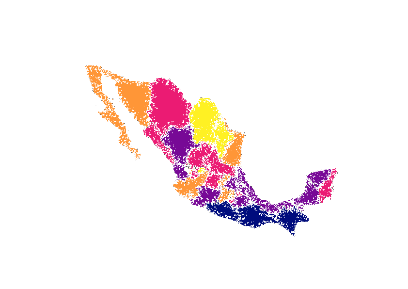
</p>


# Sistema de Información Geográfica

El **Instituto Nacional de Estadística, Geografía e Informática (`INEGI`)** tiene puestos a disposición del público los shapefiles con los distintos niveles de información geográfica. Estos archivos digitales se encuentran disponibles en el [`Marco Geoestadístico Nacional (MGN)`](https://www.inegi.org.mx/temas/mg/#Descargas), el cual es un sistema único y se presenta la división del territorio nacional en diferentes niveles de desagregación para referir geográficamente la información estadística de los censos y encuestas. Se integra al **Sistema Nacional de Información Estadística y Geográfica (`SNIEG`)**.

Este producto integra información vectorial, tablas de atributos y catálogos. Muestra la división geoestadística del territorio nacional en sucesivos niveles del territorio. Esta división está dada por los llamados **límites estadísticos**, que pueden coincidir con los límites político-administrativos oficiales, los cuales tienen sustento legal.

```{r,echo = FALSE, eval = TRUE}
require(kableExtra)
require(knitr)

tabla <- data.frame(Division = c("Estatales", "Municipales", "Localidades rurales amanzanadas", "Localidades urbanas", "Localidades rurales amanzanadas y no amanzanadas", 
                                 "Áreas geoestadísticas básicas rurales", "Áreas geoestadísticas básicas urbanas", 
                                 "Manzanas urbanas y rurales (incluyendo caserío disperso)", "Territorio insular"),
                    Unidades_territoriales= c("32", "2 469","45 397","4 911", "295 779", "17 469", "63 982", "2 513 853", "350"),
                    Datos_vectoriales = c(rep("Polígonos", 4), "Puntos", rep("Polígonos", 4))) 

kable(tabla, 
       col.names = c("División", "Unidades territoriales", "Datos vectoriales"), 
        align = "c", 
         caption = c("Tabla: Subdivisiones territoriales básicas del INEGI.")) %>%
  kable_styling(position = "center",
                 bootstrap_options = c("condensed", "responsive", "bordered", "hover")) %>%
   kable_classic(full_width = F, html_font = "Montserrat") %>%
    row_spec(0, color = "black", bold = TRUE) %>% 
     collapse_rows(columns = 1, valign = "middle") %>%
      pack_rows("AGEE", 1, 1, label_row_css = "background-color: #DFE5E5; font-size: 10px; color: #030557; padding: 3px 10px;") %>%
      pack_rows("AGEM", 2, 2, label_row_css = "background-color: #DFE5E5; font-size: 10px; color: #030557; padding: 3px 10px;") %>%
      pack_rows("Localidades", 3, 5, label_row_css = "background-color: #DFE5E5; font-size: 10px; color: #030557; padding: 3px 10px;") %>%
      pack_rows("AGEB", 6, 7, label_row_css = "background-color: #DFE5E5; font-size: 10px; color: #030557; padding: 3px 10px;") %>% 
      pack_rows("MZA",8, 8, label_row_css = "background-color: #DFE5E5; font-size: 10px; color: #030557; padding: 3px 10px;") %>% 
      pack_rows("TI", 9, 9, label_row_css = "background-color: #DFE5E5; font-size: 10px; color: #030557; padding: 3px 10px;") 
```

### Especificación del sistema de coordenadas

Ocurre a menudo que las capas de información vectorial se han obtenido de fuentes con sistemas de coordenadas distintas; por lo que se debe transformar la información para homogenizarla y representarla en el proyecto.

La [`Norma Técnica para el Sistema Geodésico Nacional`](https://www.inegi.org.mx/contenidos/temas/MapaDigital/Doc/asignar_sistema_coordenadas.pdf) define las disposiciones con el fin de que el marco sea homogéneo, compatible y comparable; y establece que el Marco de Referencia oficial para los Estados Unidos Mexicanos es el **International Terrestrial Reference Frame 2008**, con datos de época 2010.0 (`ITRF08`) asociado al **elipsoide de referencia** definido en el **GRS80**.

A continuación se enlista los datos del sistema de coordenadas para la estandarización de la información:

```{r, echo = FALSE, eval = TRUE}
tabla <- data.frame(Parametros = c("Cónica Conforme de Lambert (`CCL`)", "Dátum:", "Elipsoide", "Meridiano origen", 
                                   "Latitud origen","Primer paralelo estándar", "Segundo paralelo estándar", "Falso Este","Falso Norte"), 
                    Datos = c("", "ITRF2008", "GRS80","102° 00' 00' W.", "12° 00' 00' N.", "17° 30' N", "29° 30'N", "2 500 000", "0"))

kable(tabla, 
       col.names = c("Parámetros", ""), 
        align = "c", 
         caption = c("Tabla: Características técnicas de la información")) %>%
  kable_styling(position = "center",
                 bootstrap_options = c("condensed", "responsive", "bordered", "hover"), 
                  font_size = 10) %>%
   kable_classic(full_width = F, html_font = "Montserrat") %>%
    row_spec(0, color = "white", background = "#050844", bold = TRUE) 
```

### Geospatial Data Abstraction Library (`GDAL`)

En este documento se va a hacer uso del paquete `rgdal` el cual permite importar, exportar o bien manipular los datos especiales:

-   `readOGR()` y `writeOGR()`: para datos vectoriales\
-   `readGDAL()` y `writeGDAL()`: para rasters

También el paquete `gdalUtils` permite reproyectar, transformar, reclasificar, etc.

La función `ogrDrivers` permite visualizar los tipos de formatos que el paquete `rgdal` permite trabajar:

```{r, echo = FALSE, eval = TRUE}
kable(ogrDrivers(), 
        align = "c") %>%
  kable_styling(position = "center",
                 bootstrap_options = c("condensed", "responsive", "bordered", "hover"),
                  font_size = 10) %>%
   kable_classic(full_width = TRUE, html_font = "Montserrat") %>%
    row_spec(0, color = "black", bold = TRUE) %>%
     scroll_box(width = "100%", height = "300px")
```

### Opciones para mapas en  `ggplot2`

#### **`geom_polygon()`**
- 📦 **Datos requeridos**: `data.frame` o `tibble` **con columnas `long`, `lat`, `group` y `fill`** si quieres colores.
- ➕ Bueno si los datos están en formato plano, por ejemplo shapefiles transformados con `fortify()` o `broom::tidy()`.
- ➖ No es ideal para datos geográficos complejos (proyecciones, geometrías múltiples).

#### **`geom_map()`**
- 📦 **Datos requeridos**: dos `data.frame` (uno con `map_id`, otro con geometría).
- ➕ Útil para mapas coropléticos simples.
- ➖ Es una opción antigua y menos usada hoy. Limitada y con poca flexibilidad comparado con `geom_sf`.

#### **`geom_sf()`** ⭐ **(Recomendado)**
- 📦 **Datos requeridos**: objetos `sf` (`sf`, `sfc`, `sfg`). Estos pueden venir de shapefiles con `sf::st_read()` o conversiones desde `SpatialPolygonsDataFrame`.
- ➕ Muestra automáticamente geometría, maneja proyecciones, coord_sf, y se integra bien con otros elementos `ggplot2`.
- ➕ Puede mapear fácilmente con `fill = variable`, `color = variable`.
- 🔁 Con `ggplot(data_sf) + geom_sf(aes(fill = var))`.

#### **`layer_spatial()`** (de `ggspatial`)
- 📦 **Datos requeridos**: objetos `sf` o `Spatial*` (como `SpatialPolygonsDataFrame`).
- ➕ Permite agregar capas sin preocuparse por aes.
- ➖ Más útil como complemento (por ejemplo, para capas de fondo como ríos o caminos), pero no suele usarse como principal.

#### **`tm_shape()`** (de `tmap`, no `ggplot2`)  
- 📦 **Datos requeridos**: `sf` o `SpatialPolygonsDataFrame`.
- ➕ Muy poderoso para mapas temáticos, escala tipo ArcGIS.
- ➖ No es parte de `ggplot2`, es una alternativa. Pero es excelente para producción cartográfica.


```{r, echo = FALSE, eval = TRUE}
require(tidyverse)
require(knitr)
require(lubridate)

tribble(~Tema,                   ~Métodos                             , ~`Librería y función`,
        "Importación de datos"   , "Archivo shapefiles .shp"          ,"`rgdal::readOGR()`", 
        "Mapas coropléticos"     , "Función para crear polígonos"     ,"`ggplot2:: geom_polygon()`", 
        ""                       , "`fortify()` + datos"              ,"`ggplot() +  geom_map()`",
        ""                       , ".shp + datos"                     , "`ggspatial::layer_spatial()`",
        ""                       , ".shp + datos"                     , "`ggplot2::geom_sf()`",
        ""                       , ".shp + datos"                     , "`tmap::shape()`",
        "Etiquetado de mapas"    , "Como texto"                       , "`ggplot2::geom_label`", 
        ""                       , "Ubicación en centroides"          , "`sp::coordinates()`", 
        ""                       , "Etiquetado parcial"               , "`ifelse() + ggreppel::geom_label_repel()`"
        ) %>% kable(., caption = "Temas cubiertos en este documento.") %>%
 kable_styling(position = "center",                
                bootstrap_options = c("condensed", "responsive", "bordered", "hover"),
                 font_size = 10) %>%
  kable_classic(full_width = TRUE, html_font = "Montserrat")
```

## Base de datos

### Índice de marginación

Desde 1993, la **Secretaría General del Consejo Nacional de Población (`CONAPO`)** implementa una metodología sistemática para evaluar las disparidades territoriales mediante la construcción del Índice de marginación, basado en datos censales. Este instrumento permite una identificación precisa de las zonas y regiones que presentan mayores necesidades socioeconómicas en el país. El índice de marginación proporciona un análisis detallado que distingue entre estados, municipios, localidades y áreas geoestadísticas básicas, considerando factores críticos como el acceso a la educación, la calidad de la vivienda, el nivel de ingresos y la ubicación geográfica de los asentamientos.

En la actualidad, este índice constituye un instrumento fundamental para el diseño e implementación de políticas públicas orientadas a la reducción de las carencias socioeconómicas que afectan a la población mexicana.


La base de datos del índice de marginación en los diferentes niveles de desagregación se encuentra disponible en la página de [datos abiertos](https://www.gob.mx/conapo/documentos/indices-de-marginacion-2020-284372).

# Estructura de un mapa {.tile-text .top-tiles .tabset .tabset-fade .tabset-pills}  

## Entidad Federativa {.tabset .tabset-fade .tabset-pills}

### .shp

La función `readOGR` del paquete `rgdal`, extrae automáticamente la información utilizada por otros paquetes `SIG` de código abierto como QGIS y permite a `R` manejar una gama más amplia de formatos de datos espaciales. Esta función lee datos `OGR` y datos vectoriales, pero solamente permite manejar capas con características geométricas (no mezcla puntos, líneas o polígonos en una sola capa) y a su vez establecerá un sistema de referencia espacial si la capa tiene dichos metadatos.\

Para leer un archivo `shapefile`, se establecen los siguientes argumentos:     
- `readOGR`: Esta función se usa para leer shapefiles.    
- `dsn`: Especifica la ruta al directorio que contiene el shapefile.  
- `layer`: Especifica el nombre de la capa dentro del shapefile.  
- `encoding`: Especifica la codificación de los caracteres, en este caso, UTF-8.  
- `use_iconv`: Se usa para convertir la codificación si es necesario.  


A continuación se lee el archivo `.shp` que contiene de manera integrada la división de el área geoestadística estatal `agee`.

```{r, class.source = "fold-show", eval = FALSE}
require(rgdal)
shape_estados <- readOGR(dsn = paste0(here::here(), "/MGN 2020/conjunto_de_datos"), 
                          layer = "00ent",
                           encoding = "UTF-8",
                            use_iconv = TRUE)
```

La función `rename()` del paquete `dplyr` permite cambiar el nombre de la columna de la clave geoestadística a nivel estatal dentro de la base de datos del shape.

```{r, class.source = "fold-show", eval = FALSE}
shape_estados@data <- shape_estados@data %>%
                       rename("CVE_GEO" = "CVEGEO")
```


Un objeto `SpatialPolygons` se puede combinar con una data.frame para crear lo que se llama `SpatialPolygonsDataFrame`. La diferencia está en los atributos asociados con los polígonos. Un objeto `SpatialPolygonsDataFrame` tiene información adicional asociada a los polígonos (ejemplo, nombre de la entidad, población, etc.) mientras que `SpatialPolygons` contiene solo la información espacial (vértices) sobre el polígono.

```{r, class.source = "fold-show", eval = FALSE}
class(shape_estados)
## "SpatialPolygonsDataFrame"
## attr(,"package")
## "sp"
```

Se cambian de `IDs` de los Features del Shapefile; de esta manera si se hace alguna manipulación al shapefile directamente los polígonos tendrán el ID de la clave de la entidad y conservarán el orden. Además de que es útil cuando se necesita asegurar que los IDs de las entidades geográficas sean consistentes en longitud y formato para su posterior análisis o visualización.     

- `sp::spChFIDs` cambia los IDs de las features del objeto Spatial.
- `str_pad(shape_estados_2020@data$CVE_ENT, 2, "left", pad = "0")`: Utiliza la función `str_pad()` para rellenar con ceros a la izquierda (si es necesario) para asegurarse de que cada ID tenga al menos 2 dígitos.

```{r}
shape_estados <- shape_estados %>%
                  sp::spChFIDs(., str_pad(shape_estados@data$CVE_GEO, 2, "left", pad = "0")) 
```


Si el archivo no tuviera Sitema de Referencia de Coordenadas `CRS` asignado se debería utilizal la función `proj4string()` para asignar el `CRS` adecuado. En cambio, si se quisiera cambiar el sistema de referencia (transormar) debe utilizarse la función `spTransform()` del paquete `sp`.

La función `proj4string()`representa el sistema de referencia de coordenadas utilizado en los datos.

```{r, class.source = "fold-show", eval = FALSE}
proj4string(shape_estados) 
## "+proj=lcc +lat_0=12 +lon_0=-102 +lat_1=17.5 +lat_2=29.5 +x_0=2500000 +y_0=0 +ellps=GRS80 +units=m +no_defs"
```

### IME_2020

La base de datos del índice de marginación por estados se encuentra disponible en la página oficial de [CONAPO](https://www.gob.mx/conapo/documentos/indices-de-marginacion-2020-284372) o bien se puede consultar en la página de [Datos Abiertos](https://datos.gob.mx/) y se presenta en formato `.xlsx` [Consulta](https://datos.gob.mx/busca/dataset/indice-de-marginacion-carencias-poblacionales-por-localidad-municipio-y-entidad).

Para poder trabajar con la base de datos del índice de marginación a nivel estatal, se elimina la fila que contiene los datos a nivel nacional con la función `::filter()` del paquete `dplyr` y por otro lado se cambia el nombre de la columna `CVE_ENT` que hace referencia a la clave geográfica del estado por `CVE_GEO` para fines prácticos.

```{r, class.source = "fold-show", eval = FALSE}
IME_2020 <- read_xlsx(paste0(here::here(), "/Data/IME_2020.xlsx"), sheet = "IME_2020") %>% 
             filter(NOM_ENT != "Nacional") %>% 
              mutate(CVE_GEO = CVE_ENT) %>% 
               as.data.frame()
```

Ahora bien, para la realización de los *mapas cloropléticos* que muestran áreas geográficas divididas o regiones que están coloreadas en relación con una variable de interés. Para este documento se decide hacer uso del **grado de marginación** que permite englobar a las unidades geográficas que presentan las mismas condiciones de exclusión social en cinco categorías.

```{r, echo = FALSE, eval = TRUE}
require(kableExtra)
require(knitr)

tabla <- IME_2020 %>%
          mutate(GM_2020 = fct_relevel(GM_2020, c("Muy alto", "Alto", "Medio", "Bajo", "Muy bajo"))) %>%
           dplyr::select(GM_2020) %>%
            group_by(GM_2020) %>%
             summarise(N = n()) %>%
              ungroup() %>% 
               as.data.frame()
              
kable(tabla,
       col.names = c("Grado de \n marginación", "Estados"), 
        align = "c", 
         caption = c("Tabla: Entidades según el grado de marginación.")) %>%
  kable_styling(position = "center",
                 bootstrap_options = c("condensed", "responsive", "bordered", "hover"),
                  font_size = 10) %>%
   kable_classic(full_width = F, html_font = "Montserrat") %>%
    row_spec(0, color = "black", bold = TRUE) %>% 
      gsub("font-size: initial !important;", "font-size: 11pt !important;", .) %>%
        gsub("text-align: initial !important;", "text-align: justify !important;", .)
```

### Layers {.tile1-text .top1-tiles .tabset .tabset-pills}  

Existen dos maneras de trabajar los datos de los mapas:

-   Es trabajar con los objetos `SpatialPolygonsDataFrame` o bien `spdf` y tratar de unir los datos que se desean analizar, llamando algunas de las funciones de `join_` o `merge` del paquete `dplyr`.

-   O bien utilizar la función `fortify()` del paquete `ggplot2`, que permite convertir un objeto (ej.`spdf`) a un *data.frame*. Al hacer este tipo de conversión permite aplicar un `join` para unir ambas estructuras de datos al nuevo formato del data.frame.

#### data.frame   

##### SpatialPolygons ➡️ data.frame     

Cuando es necesario cambiar los ID's de las características en los objetos `SpatialLines` o `SpatialPolygons`, se puede usar la función `spChFIDs()` de la paquetería `sp`. Donde los nuevos ID's deben ser un vector de caracteres únicos de la longitud correcta.

La función `fortify()` convierte un objeto S3 para convertir objetos diversos a un data.frame para `ggplot2`. El data.frame resultante de la conversión de un objeto *spdf* es sumamente largo, tiene una fila por cada cambio en un polígono y un columna de grupo para separar cada polígono.

```{r capas_estados, class.source = "fold-show", results=FALSE, eval = FALSE}
capas_estados <- shape_estados %>%
                  sp::spChFIDs(., str_pad(shape_estados@data$CVE_GEO, 2, "left", pad = "0")) %>%
                   fortify(., id = "CVE_GEO") %>%
                    left_join(., IME_2020 %>% dplyr::select(CVE_GEO, NOM_ENT, GM_2020),
                               by = c("id" = "CVE_GEO")) 
```

#### SpatialPolygons   

##### SpatialPolygons ➡️ SpatialPolygons + Datos      

```{r, class.source = "fold-show", eval = FALSE}
layer_estados <- merge(shape_estados,
                        IME_2020 %>%
                         dplyr::select(c(-CVE_ENT, -NOM_ENT)) %>%
                          mutate(GM_2020 = fct_relevel(.$GM_2020,"Muy alto", "Alto", "Medio", "Bajo", "Muy bajo")),
                           by = "CVE_GEO")
```

##### Data.frame ➡️ SpatialPolygonsDataFrame       

Para poder emparejar polígonos y puntos, los objetos espaciales deben tener el mismo `CRS`. Para después poder calcular el área de cada polígono o bien se puede reproyectar los datos espaciales usando la función `spTransform`:

```{r, class.source = "fold-show", eval= FALSE}
tabla <- SpatialPointsDataFrame(data = capas_estados, 
                                 coords = capas_estados %>% 
                                             dplyr::select(long, lat), 
                                  match.ID = FALSE,
                                   proj4string = CRS("+proj=lcc +lat_0=12 +lon_0=-102 +lat_1=17.5 +lat_2=29.5 +x_0=2500000 +y_0=0 +ellps=GRS80 +units=m +no_defs"))
```

#### Tibble

##### SpatialPolygons ➡️  tbl_df/ tbl / data.frame       

Conversión de datos: `st_as_sf`, convierte un objeto externo en un spatial object. A continuación, se muestra un ejemplo de cómo visualizar objetos `sf`. Este tipo de función es un poco más amigable de usar.

La función `as_tibble` de la paquetería `tibble`, genera una base de datos genérica de S3 con métodos más eficientes para matrices y data.frame. Su envoltorio delgado permite trabajar de manera más rápida que un `data.frame`.

```{r, class.source = "fold-show", eval = FALSE}
# Paquetes 
require(tibble)
require(sf)

tbl_estados <- as_tibble(st_as_sf(shape_estados)) %>%
                merge(., IME_2020 %>% dplyr::select(CVE_GEO, GM_2020))

```

## Municipio {.tabset .tabset-fade .tabset-pills}

### .shp

La función `readOGR` del paquete `rgdal`, extrae automáticamente la información utilizada por otros paquetes `SIG` de código abierto como QGIS y permite a R manejar una gama más amplia de formatos de datos espaciales. Esta función lee datos `OGR` y datos vectoriales, pero solamente permite manejar capas con características geométricas (no mezcla puntos, líneas o polígonos en una sola capa) y a su vez establecerá un sistema de referencia espacial si la capa tiene dichos metadatos.\

Para leer un archivo `shapefile`, se establecen los siguientes argumentos:     
- `readOGR`: Esta función se usa para leer shapefiles.    
- `dsn`: Especifica la ruta al directorio que contiene el shapefile.  
- `layer`: Especifica el nombre de la capa dentro del shapefile.  
- `encoding`: Especifica la codificación de los caracteres, en este caso, UTF-8.  
- `use_iconv`: Se usa para convertir la codificación si es necesario.  


A continuación se lee el archivo .shp que contiene de manera integrada la división de el área geoestadística municipal `agem`.

```{r,results=FALSE,class.source = "fold-show", eval = FALSE}
shape_municipios <- readOGR(dsn = paste0(here::here(), "/MGN 2020/conjunto_de_datos"), 
                             layer = "00mun",
                              encoding = "UTF-8",
                               use_iconv = TRUE)
```

La función `rename()` del paquete `dplyr` permite cambiar el nombre de la columna de la clave geoestadística a nivel estatal dentro de la base de datos del shape.

```{r, class.source = "fold-show", eval = FALSE}
shape_municipios@data <- shape_municipios@data %>%
                          rename("CVE_GEO" = "CVEGEO")
```


Se cambian de `IDs` de los Features del Shapefile; de esta manera si se hace alguna manipulación al shapefile directamente los polígonos tendrán el ID de la clave de la entidad y conservarán el orden. Además de que es útil cuando se necesita asegurar que los IDs de las entidades geográficas sean consistentes en longitud y formato para su posterior análisis o visualización.     

- `sp::spChFIDs` cambia los IDs de las features del objeto Spatial.
- `str_pad(shape_municipios@data$CVE_GEO, 5, "left", pad = "0")`: Utiliza la función `str_pad()` para rellenar con ceros a la izquierda (si es necesario) para asegurarse de que cada ID tenga al menos 5 dígitos.

```{r}
shape_municipios <- shape_municipios %>%
                     sp::spChFIDs(., str_pad(shape_municipios@data$CVE_GEO, 5, "left", pad = "0"))
```


### IMM_2020

La base de datos del índice de marginación por municipios se encuentra disponible en la página oficial de [CONAPO](https://www.gob.mx/conapo/documentos/indices-de-marginacion-2020-284372) o bien se puede consultar en la página de [Datos Abiertos](https://datos.gob.mx/) y se presenta en formato `.xlsx` [Consulta](https://datos.gob.mx/busca/dataset/indice-de-marginacion-carencias-poblacionales-por-localidad-municipio-y-entidad).

Para poder trabajar con la base de datos del índice de marginación a nivel municipal, se elimina la fila que contiene los datos a nivel nacional con la función `::filter()` del paquete `dplyr` y por otro lado se cambia el nombre de la columna `CVE_MUN` que hace referencia a la clave geográfica del municipio por `CVE_GEO` para fines prácticos.

```{r, class.source = "fold-show", eval = FALSE}
IMM_2020 <- read_xlsx(paste0(here::here(), "/Data/IMM_2020.xlsx"), sheet = "IMM_2020") %>%
             filter(NOM_ENT != "Nacional") %>%
               mutate(CVE_GEO = CVE_MUN) %>%
                as.data.frame()
```

Ahora bien, para la realización de los *mapas cloropléticos* que muestran áreas geográficas divididas o regiones que están coloreadas en relación con una variable de interés. Para este documento se decide hacer uso del **grado de marginación** que permite englobar a las unidades geográficas que presentan las mismas condiciones de exclusión social en cinco categorías.

```{r, echo = FALSE, eval = TRUE}
tabla <- IMM_2020 %>%
          mutate(GM_2020 = fct_relevel(GM_2020, c("Muy alto", "Alto", "Medio", "Bajo", "Muy bajo"))) %>% 
           dplyr::select(GM_2020) %>%
            group_by(GM_2020) %>%
             summarise(N = n()) %>%
              ungroup() %>%
               as.data.frame()
 
kable(tabla,
       col.names = c("Grado de \n marginación", "Municipios"), 
        align = "c", 
         caption = c("Tabla: Municipios según el grado de marginación.")) %>%
  kable_styling(position = "center",
                 bootstrap_options = c("condensed", "responsive", "bordered", "hover"),
                  font_size = 10) %>%
   kable_classic(full_width = F, html_font = "Montserrat") %>%
    row_spec(0, color = "black", bold = TRUE) %>% 
      gsub("font-size: initial !important;", "font-size: 11pt !important;", .) %>%
        gsub("text-align: initial !important;", "text-align: justify !important;", .)
```

### Layers {.tile1-text .top1-tiles .tabset .tabset-pills}

Existen dos maneras de trabajar los datos de los mapas:

-   Es trabajar con los objetos `SpatialPolygonsDataFrame` o bien `spdf` y tratar de unir los datos que se desean analizar, llamando algunas de las funciones de `join_` o `merge` del paquete `dplyr`.

-   O bien utilizar la función `fortify()` del paquete `ggplot2`, que permite convertir un objeto (ej.`spdf`) a un *data.frame*. Al hacer este tipo de conversión permite aplicar un `join` para unir ambas estructuras de datos al nuevo formato del data.frame.

#### data.frame

##### SpatialPolygons ➡️ data.frame     

Cuando es necesario cambiar los ID's de las características en los objetos `SpatialLines` o `SpatialPolygons`, se puede usar la función `spChFIDs()` de la paquetería `sp`. Donde los nuevos ID's deben ser un vector de caracteres únicos de la longitud correcta.

La función `fortify()` convierte un objeto S3 para convertir objetos diversos a un data.frame para `ggplot2`. El data.frame resultante de la conversión de un objeto *spdf* es sumamente largo, tiene una fila por cada cambio en un polígono y un columna de grupo para separar cada polígono.

```{r capas_municipio, class.source = "fold-show", eval = FALSE}
capas_municipio <-  shape_municipios %>%
                     sp::spChFIDs(., str_pad(shape_municipios@data$CVE_GEO, 5, "left", pad = "0")) %>%
                      fortify(., id = "CVE_GEO") %>%
                       left_join(., IMM_2020 %>% dplyr::select(CVE_GEO, CVE_ENT, NOM_ENT, NOM_MUN, GM_2020), by = c("id" = "CVE_GEO")) 
```

#### SpatialPolygons

##### SpatialPolygons ➡️  SpatialPolygons + Datos     

```{r, class.source = "fold-show", eval = FALSE}
layer_municipios <- merge(shape_municipios,
                          IMM_2020 %>% dplyr::select(c(-CVE_ENT, -CVE_MUN)) %>%
                                        mutate(GM_2020 = fct_relevel(.$GM_2020,"Muy alto", "Alto", "Medio", "Bajo", "Muy bajo")),
                          by = "CVE_GEO")
```

#### Tibble

##### SpatialPolygons ➡️  tbl_df/ tbl / data.frame    

Conversión de datos: `st_as_sf`, convierte un objeto externo en un spatial object. A continuación, se muestra un ejemplo de cómo visualizar objetos `sf`. Este tipo de función es un poco más amigable de usar.

La función `as_tibble` de la paquetería `tibble`, genera una base de datos genérica de S3 con métodos más eficientes para matrices y data.frame. Su envoltorio delgado permite trabajar de manera más rápida que un `data.frame`.

```{r, class.source = "fold-show", eval = FALSE}
# Paquetes 
require(tibble)
require(sf)

tbl_municipios <- as_tibble(st_as_sf(shape_municipios)) %>%
                    merge(., IMM_2020 %>% dplyr::select(CVE_GEO, GM_2020))
```

### Zonas Metropolitanas    

El Consejo Nacional de Población (`CONAPO`), en colaboración con instituciones clave como el `INEGI` y la `SEDATU`, ha establecido un marco comprehensivo para la delimitación y caracterización de las áreas urbanas más significativas de México. Este esfuerzo interinstitucional refleja la importancia de coordinar diferentes perspectivas y capacidades técnicas para comprender la compleja realidad metropolitana del país.

La conceptualización de una zona metropolitana es particularmente relevante en el contexto mexicano. Se define específicamente como una agrupación de dos o más municipios que albergan una ciudad con población superior a los 100,000 habitantes. Lo distintivo de estas zonas es que sus funciones y actividades trascienden los límites municipales originales, estableciendo una integración socioeconómica significativa con las áreas circundantes. 

Página oficial del `CONAPO`: Aquí encontrarás publicaciones y datos relacionados con las zonas metropolitanas.      

**Publicación**: [Metrópolis de México 2020](https://www.gob.mx/sedatu/documentos/metropolis-de-mexico-2020?state=published)     

**Base de Datos**: [Datos Abiertos](https://datos.gob.mx/) y se presenta en formato `.xlsx`   


```{r, class.source = "fold-show", eval = FALSE}
ZM_2020 <- read_xlsx(paste0(here::here(), "/Data/ZM_2020.xlsx"), sheet = "ZM_2020", range = "A7:I428") 
```

```{r, echo = FALSE, eval = TRUE}
kable(head(ZM_2020, 10),
       align = "c", 
        caption = c("Base: Zonas Metropolitanas 2020.")) %>%
 kable_styling(position = "center",
                font_size = 11,
                 bootstrap_options = c("condensed", "responsive", "bordered")) %>%
  kable_classic(full_width = T, html_font = "Montserrat") %>%
   row_spec(0, color = "black", bold = TRUE) %>%
    footnote(footnote_as_chunk = T,
              general_title = "Fuentes:",
               general = "Estimaciones del CONAPO con base en el INEGI, Censo de Población y Vivienda 2020") 
```

## Localidad {.tabset .tabset-fade .tabset-pills}

### .shp

La función `readOGR` del paquete `rgdal`, extrae automáticamente la información utilizada por otros paquetes `SIG` de código abierto como QGIS y permite a R manejar una gama más amplia de formatos de datos espaciales. Esta función lee datos `OGR` y datos vectoriales, pero solamente permite manejar capas con características geométricas (no mezcla puntos, líneas o polígonos en una sola capa) y a su vez establecerá un sistema de referencia espacial si la capa tiene dichos metadatos.\  

Para leer un archivo `shapefile`, se establecen los siguientes argumentos:     
- `readOGR`: Esta función se usa para leer shapefiles.    
- `dsn`: Especifica la ruta al directorio que contiene el shapefile.  
- `layer`: Especifica el nombre de la capa dentro del shapefile.  
- `encoding`: Especifica la codificación de los caracteres, en este caso, UTF-8.  
- `use_iconv`: Se usa para convertir la codificación si es necesario.  


A continuación se lee el archivo .shp que contiene de manera integrada la división de el área geoestadística por localidad.  

```{r, echo = FALSE, eval = TRUE} 
tabla <- data.frame(`Tipo de shapefile` = c("Punto", "Polígono"),
                    `Representación` = c(" Ubicación puntual (centroide)", " Área delimitada"),
                    `Usos comunes` = c("Localidades rurales o pequeñas", " Localidades urbanas grandes"),
                    `Nivel de detalle` = c("Bajo", "Alto"))
kable(tabla,
      col.names = c("Tipo de shapefile", "Representación", "Usos comunes", "Nivel de detalle"),
       align = "c", 
       caption = c("Shapefiles por localidades")) %>%
 kable_styling(position = "center",
                font_size = 11,
                 bootstrap_options = c("condensed", "responsive", "bordered")) %>%
  kable_classic(full_width = T, html_font = "Montserrat") %>%
   row_spec(0, color = "black", bold = TRUE) %>%
    footnote(footnote_as_chunk = T,
              general_title = "Fuentes:",
               general = "INEGI") 
```


**Shapefiles de polígonos**
  - Representan localidades que tienen una **delimitación física clara**, normalmente **zonas urbanas**.
- Cada polígono muestra la **extensión territorial real** de la localidad.
- Son utilizados cuando se cuenta con información **más detallada y precisa** sobre los límites de la localidad.
- Comunes en **ciudades, cabeceras municipales o zonas con planificación urbana**. 


```{r,results=FALSE,class.source = "fold-show", eval = FALSE}
shape_localidad <- readOGR(dsn =paste0(here::here(), "/MGN 2020/conjunto_de_datos"), 
                            layer = "00l",
                             encoding = "UTF-8",
                              use_iconv = TRUE)
```

**Shapefiles de puntos**
  - Representan **localidades rurales** o **pequeñas localidades urbanas**.
- Cada punto indica la **ubicación geográfica aproximada** del centroide o punto representativo de la localidad.
- Útiles cuando **no se tiene delimitación precisa** del área que abarca la localidad.
- Más comunes para localidades con **poca población o dispersas**.


```{r,results=FALSE,class.source = "fold-show", eval = FALSE}
shape_localidad_p <- readOGR(dsn ="D:/MGN/MGN 2020/MGN 2020/conjunto_de_datos", 
                              layer = "00lpr",
                               encoding = "UTF-8",
                               use_iconv = TRUE)
```


Un objeto `SpatialPolygons` se puede combinar con una data.frame para crear lo que se llama `SpatialPolygonsDataFrame`. La diferencia está en los atributos asociados con los polígonos. Un objeto `SpatialPolygonsDataFrame` tiene información adicional asociada a los polígonos (ejemplo, nombre de la entidad, población, etc.) mientras que `SpatialPolygons` contiene solo la información espacial (vértices) sobre el polígono.

```{r, class.source = "fold-show", eval = FALSE}
class(shape_localidad)
## "SpatialPolygonsDataFrame"
## attr(,"package")
## "sp"
```
```{r, class.source = "fold-show", eval = FALSE}
class(shape_localidad_p)
## "SpatialPointsDataFrame"
## attr(,"package")
## "sp"
```


La función `rename()` del paquete `dplyr` permite cambiar el nombre de la columna de la clave geoestadística a nivel estatal dentro de la base de datos del shape. 

```{r, class.source = "fold-show", eval = FALSE}
shape_localidad@data <- shape_localidad@data %>%
                         rename("CVE_GEO" = "CVEGEO") 
```

Por otro lado, se trabajará con los polígonos urbanos `AMBITO %in% Urbana`, ya que las localidades rurales se encuentran en el shapefile de puntos. 

```{r}
shape_localidad <- shape_localidad %>% 
                    filter(AMBITO %in% "Urbana") 
```


Se cambian de `IDs` de los Features del Shapefile; de esta manera si se hace alguna manipulación al shapefile directamente los polígonos tendrán el ID de la clave de la entidad y conservarán el orden. Además de que es útil cuando se necesita asegurar que los IDs de las entidades geográficas sean consistentes en longitud y formato para su posterior análisis o visualización.     

- `sp::spChFIDs` cambia los IDs de las features del objeto Spatial.
- `str_pad(shape_localidad@data$CVE_GEO, 9, "left", pad = "0")`: Utiliza la función `str_pad()` para rellenar con ceros a la izquierda (si es necesario) para asegurarse de que cada ID tenga al menos 9 dígitos.

```{r}
shape_localidad <- shape_localidad %>%
                    sp::spChFIDs(., str_pad(shape_localidad@data$CVE_GEO, 9, "left", pad = "0"))
```


### IML_2020

La base de datos del índice de marginación por localidades se encuentra disponible en la página oficial de [CONAPO](https://www.gob.mx/conapo/documentos/indices-de-marginacion-2020-284372) o bien se puede consultar en la página de [Datos Abiertos](https://datos.gob.mx/) y se presenta en formato `.xlsx` [Consulta](https://datos.gob.mx/busca/dataset/indice-de-marginacion-carencias-poblacionales-por-localidad-municipio-y-entidad).

Para poder trabajar con la base de datos del índice de marginación a nivel localidad, se cambia el nombre de la columna `CVE_LOC` que hace referencia a la clave geográfica de la localidad por `CVE_GEO` para fines prácticos.

```{r, class.source = "fold-show", eval = FALSE}
IML_2020 <- read_xlsx(paste0(here::here(), "/Data/IML_2020.xlsx"), sheet = "IML_2020") %>%
              mutate(CVE_GEO = CVE_LOC) %>% 
               as.data.frame()
```

Ahora bien, para la realización de los *mapas cloropléticos* que muestran áreas geográficas divididas o regiones que están coloreadas en relación con una variable de interés. Para este documento se decide hacer uso del **grado de marginación** que permite englobar a las unidades geográficas que presentan las mismas condiciones de exclusión social en cinco categorías.

```{r, echo = FALSE, eval = TRUE}
require(kableExtra)
require(knitr)

tabla <- IML_2020 %>%
          mutate(GM_2020 = fct_relevel(GM_2020, c("Muy alto", "Alto", "Medio", "Bajo", "Muy bajo"))) %>%
           dplyr::select(GM_2020) %>%
            group_by(GM_2020) %>%
             summarise(N = n()) %>%
              ungroup() %>% 
               as.data.frame() %>%
                mutate(N = format(.$N, big.mark   = " "))

kable(tabla,
       col.names = c("Grado de \n marginación", "Localidades"), 
        align = "c", 
         caption = c("Tabla: Localidades según el grado de marginación.")) %>%
  kable_styling(position = "center",
                 bootstrap_options = c("condensed", "responsive", "bordered", "hover"), 
                  font_size = 10) %>%
   kable_classic(full_width = F, html_font = "Montserrat") %>%
    row_spec(0, color = "black", bold = TRUE) %>% 
      gsub("font-size: initial !important;", "font-size: 11pt !important;", .) %>%
        gsub("text-align: initial !important;", "text-align: justify !important;", .)
```

### Layers {.tile1-text .top1-tiles .tabset .tabset-pills}

Existen dos maneras de trabajar los datos de los mapas:

-   Es trabajar con los objetos `SpatialPolygonsDataFrame` o bien `spdf` y tratar de unir los datos que se desean analizar, llamando algunas de las funciones de `join_` o `merge` del paquete `dplyr`.

-   O bien utilizar la función `fortify()` del paquete `ggplot2`, que permite convertir un objeto (ej.`spdf`) a un *data.frame*. Al hacer este tipo de conversión permite aplicar un `join` para unir ambas estructuras de datos al nuevo formato del data.frame.

#### data.frame

##### SpatialPolygons ➡️  data.frame    

Cuando es necesario cambiar los ID's de las características en los objetos `SpatialLines` o `SpatialPolygons`, se puede usar la función `spChFIDs()` de la paquetería `sp`. Donde los nuevos ID's deben ser un vector de caracteres únicos de la longitud correcta.

La función `fortify()` convierte un objeto S3 para convertir objetos diversos a un data.frame para `ggplot2`. El data.frame resultante de la conversión de un objeto *spdf* es sumamente largo, tiene una fila por cada cambio en un polígono y un columna de grupo para separar cada polígono.

```{r capas_localidad, class.source = "fold-show", eval = FALSE}
capas_localidad <- shape_localidad %>%
                    sp::spChFIDs(., str_pad(shape_localidad@data$CVE_GEO, 9, "left", pad = "0")) %>%
                     fortify(., id = c("CVE_GEO")) 

capas_localidad <- capas_localidad %>% 
                    inner_join(., IML_2020 %>% dplyr::select(CVE_GEO, ENT, MUN, LOC, GM_2020), 
                                   by = c("id" = "CVE_GEO")) 

length(unique(capas_localidad$id)) 
```

```{r}
capas_localidad_p <- shape_localidad_p %>% 
                      fortify(., id = c("CVE_GEO")) %>%
                       inner_join(., IML_2020 %>% dplyr::select(CVE_GEO, ENT, MUN, LOC, GM_2020), 
                                     by = c("CVE_GEO")) 
capas_localidad_p <- shape_localidad_p %>%
                      as.data.frame() %>%
                       mutate(lon = coordinates(shape_localidad_p)[, 1],
                              lat = coordinates(shape_localidad_p)[, 2]) %>%
                       inner_join(IML_2020 %>% select(CVE_GEO, ENT, MUN, LOC, GM_2020),
                        by = "CVE_GEO")
```


#### SpatialPolygon

##### SpatialPolygons ➡️  SpatialPolygons + Datos

```{r, class.source = "fold-show", eval = FALSE}
layer_localidad <- inner_join(shape_localidad,
                               IML_2020 %>%
                                  dplyr::select(c(-CVE_LOC)) %>%
                                   mutate(GM_2020 = fct_relevel(.$GM_2020,"Muy alto", "Alto", "Medio", "Bajo", "Muy bajo")),
                               by = "CVE_GEO")
```

```{r, class.source = "fold-show", eval = FALSE}
layer_localidad_p <- inner_join(shape_localidad_p,
                                 IML_2020 %>%
                                    dplyr::select(c(-CVE_LOC)) %>%
                                     mutate(GM_2020 = fct_relevel(.$GM_2020,"Muy alto", "Alto", "Medio", "Bajo", "Muy bajo")),
                                 by = "CVE_GEO")
```


#### Tibble

##### SpatialPolygons ➡️  tbl_df/ tbl / data.frame    

Conversión de datos: `st_as_sf`, convierte un objeto externo en un spatial object. A continuación, se muestra un ejemplo de cómo visualizar objetos `sf`. Este tipo de función es un poco más amigable de usar.

La función `as_tibble` de la paquetería `tibble`, genera una base de datos genérica de S3 con métodos más eficientes para matrices y data.frame. Su envoltorio delgado permite trabajar de manera más rápida que un `data.frame`.

```{r, class.source = "fold-show", eval = FALSE}
# Paquetes 
require(tibble)
require(sf)

tbl_localidad <- as_tibble(st_as_sf(shape_localidad)) %>%
                    merge(., IML_2020 %>% dplyr::select(CVE_GEO, GM_2020)) 

tbl_localidad_p <- as_tibble(st_as_sf(shape_localidad_p)) %>%
                    merge(., IML_2020 %>% dplyr::select(CVE_GEO, GM_2020))
```

## AGEB {.tabset .tabset-fade .tabset-pills}

### .shp

La función `readOGR` del paquete `rgdal`, extrae automáticamente la información utilizada por otros paquetes `SIG` de código abierto como QGIS y permite a R manejar una gama más amplia de formatos de datos espaciales. Esta función lee datos `OGR` y datos vectoriales, pero solamente permite manejar capas con características geométricas (no mezcla puntos, líneas o polígonos en una sola capa) y a su vez establecerá un sistema de referencia espacial si la capa tiene dichos metadatos.\  

Para leer un archivo `shapefile`, se establecen los siguientes argumentos:     
- `readOGR`: Esta función se usa para leer shapefiles.    
- `dsn`: Especifica la ruta al directorio que contiene el shapefile.  
- `layer`: Especifica el nombre de la capa dentro del shapefile.  
- `encoding`: Especifica la codificación de los caracteres, en este caso, UTF-8.  
- `use_iconv`: Se usa para convertir la codificación si es necesario.  


A continuación se lee el archivo .shp que contiene de manera integrada la división de el área geoestadística a nivel ageb `ageb`.

```{r,results=FALSE,class.source = "fold-show", eval = FALSE}
shape_ageb <- readOGR(dsn = paste0(here::here(), "/MGN 2020/conjunto_de_datos"), 
                       layer = "00a",
                        encoding = "UTF-8",
                         use_iconv = TRUE)
```

La función `rename()` del paquete `dplyr` permite cambiar el nombre de la columna de la clave geoestadística a nivel estatal dentro de la base de datos del shape.

```{r, class.source = "fold-show", eval = FALSE}
shape_ageb@data <- shape_ageb@data %>%
                    rename("CVE_GEO" = "CVEGEO")
```

Se cambian de `IDs` de los Features del Shapefile; de esta manera si se hace alguna manipulación al shapefile directamente los polígonos tendrán el ID de la clave de la entidad y conservarán el orden. Además de que es útil cuando se necesita asegurar que los IDs de las entidades geográficas sean consistentes en longitud y formato para su posterior análisis o visualización.     

- `sp::spChFIDs` cambia los IDs de las features del objeto Spatial.
- `str_pad(shape_ageb@data$CVE_GEO, 13, "left", pad = "0")`: Utiliza la función `str_pad()` para rellenar con ceros a la izquierda (si es necesario) para asegurarse de que cada ID tenga al menos 13 dígitos.

```{r}
shape_ageb <- shape_ageb %>%
               sp::spChFIDs(., str_pad(shape_ageb@data$CVE_GEO, 13, "left", pad = "0"))
```

### IMU_2020

La base de datos del índice de marginación por ageb se encuentra disponible en la página oficial de [CONAPO](https://www.gob.mx/conapo/documentos/indices-de-marginacion-2020-284372) o bien se puede consultar en la página de [Datos Abiertos](https://datos.gob.mx/) y se presenta en formato `.xlsx` [Consulta](https://datos.gob.mx/busca/dataset/indice-de-marginacion-carencias-poblacionales-por-localidad-municipio-y-entidad).

Para poder trabajar con la base de datos del índice de marginación a nivel ageb, se cambia el nombre de la columna \``CVE_AGEB` que hace referencia a la clave geográfica de la ageb por `CVE_GEO` para fines prácticos.

```{r, class.source = "fold-show", eval = FALSE}
IMU_2020 <- read_xlsx(paste0(here::here(), "/Data/IMU_2020.xlsx"), sheet = "IMU_2020") %>%
             mutate(CVE_GEO = CVE_AGEB) %>% 
              as.data.frame()
```

Ahora bien, para la realización de los *mapas cloropléticos* que muestran áreas geográficas divididas o regiones que están coloreadas en relación con una variable de interés. Para este documento se decide hacer uso del **grado de marginación** que permite englobar a las unidades geográficas que presentan las mismas condiciones de exclusión social en cinco categorías.

```{r, echo = FALSE, eval = TRUE}
require(kableExtra)
require(knitr)

tabla <- IMU_2020 %>%
          mutate(GM_2020 = fct_relevel(GM_2020, c("Muy alto", "Alto", "Medio", "Bajo", "Muy bajo"))) %>%
           dplyr::select(GM_2020) %>%
            group_by(GM_2020) %>%
             summarise(N = n()) %>%
              ungroup() %>% 
               as.data.frame() %>%
                mutate(N = format(.$N, big.mark   = " "))

kable(tabla,
       col.names = c("Grado de \n marginación", "Ageb"), 
        align = "c", 
         caption = c("Tabla: Agebs según el grado de marginación.")) %>%
  kable_styling(position = "center",
                 bootstrap_options = c("condensed", "responsive", "bordered", "hover"), 
                  font_size = 10) %>%
   kable_classic(full_width = F, html_font = "Montserrat") %>%
    row_spec(0, color = "black", bold = TRUE) %>% 
      gsub("font-size: initial !important;", "font-size: 11pt !important;", .) %>%
        gsub("text-align: initial !important;", "text-align: justify !important;", .)
```

### Layers {.tile1-text .top1-tiles .tabset .tabset-pills}

Existen dos maneras de trabajar los datos de los mapas:

-   Es trabajar con los objetos `SpatialPolygonsDataFrame` o bien `spdf` y tratar de unir los datos que se desean analizar, llamando algunas de las funciones de `join_` o `merge` del paquete `dplyr`.

-   O bien utilizar la función `fortify()` del paquete `ggplot2`, que permite convertir un objeto (ej.`spdf`) a un *data.frame*. Al hacer este tipo de conversión permite aplicar un `join` para unir ambas estructuras de datos al nuevo formato del data.frame.

#### data.frame

##### SpatialPolygons ➡️  data.frame      

Cuando es necesario cambiar los ID's de las características en los objetos `SpatialLines` o `SpatialPolygons`, se puede usar la función `spChFIDs()` de la paquetería `sp`. Donde los nuevos ID's deben ser un vector de caracteres únicos de la longitud correcta.

La función `fortify()` convierte un objeto S3 para convertir objetos diversos a un data.frame para `ggplot2`. El data.frame resultante de la conversión de un objeto *spdf* es sumamente largo, tiene una fila por cada cambio en un polígono y un columna de grupo para separar cada polígono.

```{r capas_ageb, class.source = "fold-show", eval = FALSE}
capas_ageb <- shape_ageb %>%
               sp::spChFIDs(., str_pad(shape_ageb@data$CVE_GEO, 13, "left", pad = "0")) %>%
                dplyr::select(CVE_GEO) %>%
                 dplyr::filter(CVE_GEO %in% IMU_2020$CVE_GEO) 

capas_ageb <- capas_ageb %>% 
               fortify(., id = "CVE_GEO") 

capas_ageb <- capas_ageb %>%
               left_join(., IMU_2020 %>% dplyr::select(CVE_GEO, GM_2020), 
                         by = c("id" = "CVE_GEO")) 
```


#### SpatialPolygons

##### SpatialPolygons ➡️  SpatialPolygons + Datos     

```{r, class.source = "fold-show", eval = FALSE}
layer_ageb <- merge(shape_ageb,
                     IMU_2020 %>%
                        dplyr::select(c(-CVE_AGEB)) %>%
                         mutate(GM_2020 = fct_relevel(.$GM_2020,"Muy alto", "Alto", "Medio", "Bajo", "Muy bajo")),
                    by = "CVE_GEO")
```

#### Tibble

##### SpatialPolygons ➡️  tbl_df/ tbl / data.frame      

Conversión de datos: `st_as_sf`, convierte un objeto externo en un spatial object. A continuación, se muestra un ejemplo de cómo visualizar objetos `sf`. Este tipo de función es un poco más amigable de usar.

La función `as_tibble` de la paquetería `tibble`, genera una base de datos genérica de S3 con métodos más eficientes para matrices y data.frame. Su envoltorio delgado permite trabajar de manera más rápida que un `data.frame`.

```{r, class.source = "fold-show", eval = FALSE}
# Paquetes 
require(tibble)
require(sf)

tbl_ageb <- as_tibble(st_as_sf(shape_ageb)) %>%
                         IMU_2020 %>% dplyr::select(CVE_GEO, GM_2020)
```

### Zona Metropolitanas  

El Consejo Nacional de Población (`CONAPO`), en colaboración con instituciones clave como el `INEGI` y la `SEDATU`, ha establecido un marco comprehensivo para la delimitación y caracterización de las áreas urbanas más significativas de México. Este esfuerzo interinstitucional refleja la importancia de coordinar diferentes perspectivas y capacidades técnicas para comprender la compleja realidad metropolitana del país.

La conceptualización de una zona metropolitana es particularmente relevante en el contexto mexicano. Se define específicamente como una agrupación de dos o más municipios que albergan una ciudad con población superior a los 100,000 habitantes. Lo distintivo de estas zonas es que sus funciones y actividades trascienden los límites municipales originales, estableciendo una integración socioeconómica significativa con las áreas circundantes. 

Página oficial del `CONAPO`: Aquí encontrarás publicaciones y datos relacionados con las zonas metropolitanas.      

**Publicación**: [Metrópolis de México 2020](https://www.gob.mx/sedatu/documentos/metropolis-de-mexico-2020?state=published)     

**Base de Datos**: [Datos Abiertos](https://datos.gob.mx/) y se presenta en formato `.xlsx`   

```{r capas_zm, class.source = "fold-show", eval = FALSE}
capas_zm <- shape_ageb %>%
             sp::spChFIDs(., str_pad(shape_ageb@data$CVE_GEO, 13, "left", pad = "0")) %>%
              spdplyr:::inner_join.Spatial(., IMU_2020 %>% dplyr::select(CVE_GEO, ENT, NOM_ENT, MUN, NOM_MUN, LOC, NOM_LOC, GM_2020), 
                                               by = c("CVE_GEO")) %>% 
               mutate(CVE_MUN = paste0(ENT, MUN)) %>%
                spdplyr:::inner_join.Spatial(., ZM_2020 %>% dplyr::select(CVE_MUN, CVE_ZM, NOM_ZM), 
                                                 by = "CVE_MUN") %>%
                 filter(CVE_ZM %in% "09.01")

capas_zm_data <- capas_zm@data

capas_zm_fortify  <- capas_zm %>%
                       fortify(., id = "CVE_GEO")

capas_zm <- capas_zm_fortify %>%
             left_join(capas_zm_data, by = c("id" = "CVE_GEO"))

rm(capas_zm_data, capas_zm_fortify)
```

# Mapas por desagregación geográfica {.tile1-text .top1-tiles .tabset .tabset-pills}

### Estructura básica de un mapa

La forma más básica de mapear datos en `R` es crear un objeto `ggplot()` regular y mapear los argumentos `x = longuitude` y la `y = latitude`. Se puede usar esta técnica para crear mapas de áreas geográficas, como estados o países, y para gráficar ubicaciones como puntos, líneas y otras formas. El paquete `ggplot2` incluye algunos conjuntos de funciones `geom` que permiten graficar con información geográfica. Teniendo en cuenta que el data.frame incluye las columnas con ubicación (`long` y `lat`). También incluye una columna que describe el orden en que se deben conectar estos puntos para formar un polígono (`order`), el nombre del estado (`NOM_ENT`) y una columna de `group` que separa los puntos en polígonos únicos que se deben trazar.

```{r, class.source = "fold-hide", eval = FALSE}
p <- ggplot() + 
      geom_polygon(data = capas_estados,
                    mapping = aes(x = long, 
                                   y = lat, 
                                    group = group),
                     fill = "#ECECEC", 
                     color = "dark grey",
                      size = 0.5) +
        expand_limits(x = capas_estados$long,  
                      y = capas_estados$lat) + 
         theme_bw() + 
          theme(plot.title = element_text(size = 24, hjust = 0.15, family = "Montserrat", face = "bold"),
                plot.caption = element_text(size = 10, hjust = 0.2, vjust = 1, family = "Montserrat"),
                axis.text = element_text(family = "Montserrat"),
                axis.title = element_text(family = "Montserrat")) +
       labs(title = "Estructura básica de un mapa",
              caption = expression(paste("Fuentes: Estimaciones del CONAPO con base en el INEGI, Censo de Población y Vivienda 2020")))
p
```

{width="70%" fig-align="center"}  

## Entidad Federativa {.tabset .tabset-fade .tabset-pills}

### `geom_map` {.tabset .tabset-fade .tabset-pills}

La función `ggmap()` devuelve un objeto `ggplot`. Puede usar este objeto `ggplot` resultante como lo haría con cualquier otro objeto ggplot (ejemplo, agregar geoms, cambiar tema). [GitHub: fresques/ggmap](https://github.com/fresques/ggmap)

Una de las bondades del paquete `ggmap`, permite hacer mediante el uso de herramientas de *Google Maps* directamente desde `R`. Este paquete permite extraer un mapa base de *Google Maps* y algunos otros servidores de mapas, para que luego se puedan trazar y agregar puntos, polígonos, líneas y otros elementos usando funciones `ggplot2`. Este paquete usa la `API` de *Google Maps*. Otras funciones en el paquete `ggmap`, necesita una clave `API` de Google Maps para que funcione.

#### Base  

```{r, class.source = "fold-hide"}
# Paquete
require(ggmap) 

p <- IME_2020 %>% 
      mutate(GM_2020 = fct_relevel(.$GM_2020,"Muy alto","Alto","Medio","Bajo","Muy bajo")) %>%
       ggplot() + 
        geom_map(map = capas_estados, 
                  aes(map_id = CVE_GEO, fill = GM_2020,  color = "GM_2020")) +
          expand_limits(x = capas_estados$long, 
                        y = capas_estados$lat) + 
           theme_transparent() + 
            theme(plot.title = element_text(size = 22, hjust = 0.15, family = "Montserrat", face = "bold"),
                  plot.subtitle = element_text(size = 18, hjust = 0, family = "Montserrat Medium"),
                  plot.caption = element_text(size = 10, hjust = 0.2, vjust = 1, family = "Montserrat"),
                  legend.key.size = unit(0.5, "cm"),
                  legend.text = element_text(size = 10, family = "Montserrat"), 
                  legend.title = element_text(size = 12, hjust = 0.5, family = "Montserrat", face = "bold"),
                  legend.position = c(0.8, 0.7)) + 
             scale_fill_viridis_d(option = "A", begin = 0.3, end = 0.8) + 
              scale_color_manual(values = c("#BDBDBD")) + 
               guides(color = 'none') +
       labs(title = "Índice de marginación a nivel estatal, 2020",
            subtitle = "Utilizando ggmap",
             fill = stringr::str_wrap("Grado de marginación", 10),
              caption = expression(paste("Fuentes: Estimaciones del CONAPO con base en el INEGI, Censo de Población y Vivienda 2020")))

#path = "/Output/IME_2020_gmap.pdf"
#ggexport(p, width = 8, height = 5, res = 400, filename = path)
p
```

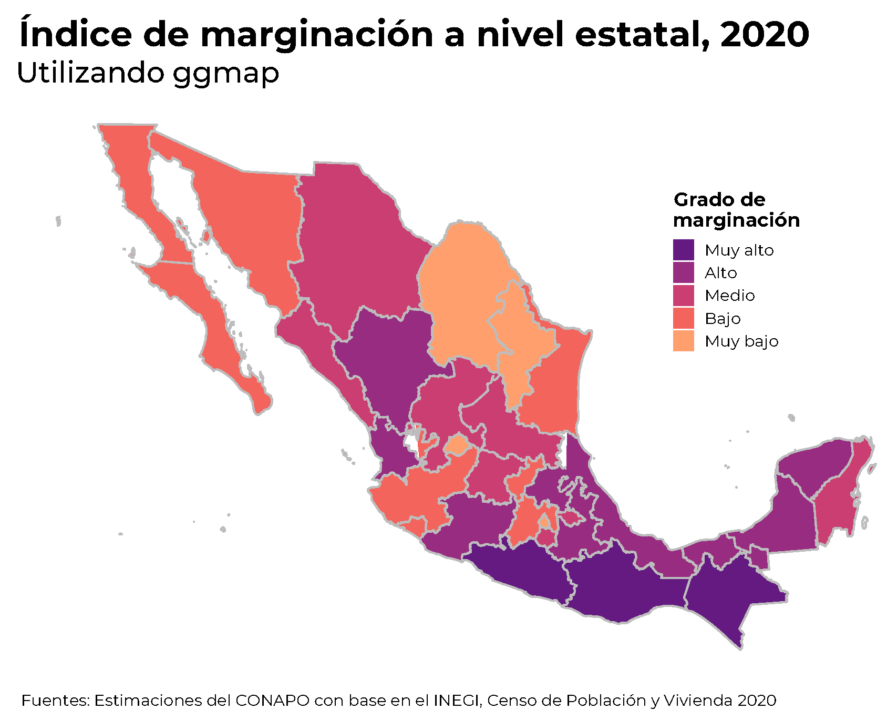{width="70%" fig-align="center"}  

#### Google API 

Al utilizar la paquetería `ggmap` permitira usar una colección de funciones para visualizar datos espaciales y modelos sobre mapas estáticos de varias fuentes en línea como *Google Maps*.  Incluye herramientas comunes a esas tareas, incluidas funciones de geolocalización y enrutamiento, además de que estéticamente se vean más profesionales.  
Para obtener más funciones, consulte la documentación de [`ggmap`]( https://journal.r-project.org/archive/2013-1/kahle-wickham.pdf) o ([guias básicas de introducción a ggmap](https://www.nceas.ucsb.edu/sites/default/files/2020-04/ggmapCheatsheet.pdf), [Mapas estáticos con ggmap](http://www.riaat.ujat.mx/hablandoalaire/tutoriales/Tutorial_MapasEstaticos_ggmap.pdf)).     

La idea central que impulsa `ggmap` es tomar una imagen de mapa descargada de la plataforma de Google Maps y, trazarla como una capa contextual usando el paquete `ggplot2` y posteriormente incluir capas de contenido adicionales de datos, estadísticas o modelos en la parte superior del mapa.   

Pero para poder acceder a esta nube de datos, la función `get_map()` es una función contenedora para las funciones subyacentes `get_googlemap`, `get_openstreetmap`, `get_stamenmap` y `get_cloudmademap` que acepta una amplia gama de argumentos y devuelve un objeto ráster clasificado para trazar con **ggmap**.  Donde la característica importante de cualquier mapa es la ubicación `longitud/latitud`. 

Si bien cada fuente de mapas tiene su propia interfaz de programación de aplicaciones web (`API`), en este caso, es necesario crear una cuenta en [`Google Cloud`](https://cloud.google.com/?hl=es) y generar una credencial para habilitar a las *API de Google*.   

```{r, class.source = "fold-show", eval = FALSE}
require(ggmap)
register_google(key = "[your key]")
```

A menudo se necesita recopilar conjuntos de datos espaciales de diferentes fuentes y/o datos que cubran diferentes extensiones espaciales. Donde muchas veces los datos espaciales provienen de diferentes fuentes y cubren diferentes extensiones que a menudo se encuentran en diferentes sistemas de referencia de coordenadas (`CRS`), como es el caso del índice de marginación a nivel estatal que fue proyectado con los *shapefiles* proporcionados por el INEGI.    

```{r,class.source = "fold-show"}
## El sistema de referencia de coordenadas (INEGI)
proj4string(shape_estados) 
## "+proj=lcc +lat_0=12 +lon_0=-102 +lat_1=17.5 +lat_2=29.5 +x_0=2500000 +y_0=0 +ellps=GRS80 +units=m +no_defs"
```

Haciendo uso de la función `spTransform()` del paquete `sp`, proporcionan la transformación entre datum(s) y conversión entre proyecciones (también conocidas como *proyección y/o reproyección*), de un sistema de referencia de coordenadas (`CRS`).      

```{r}
require(sp)

shape_estados_T <- spTransform(shape_estados, CRSobj = CRS('+proj=longlat +ellps=WGS84 +datum=WGS84 +no_defs')) %>%
                    sp::spChFIDs(., str_pad(shape_estados@data$CVE_GEO, 2, "left", pad = "0")) %>%
                     fortify(., id = "CVE_GEO") %>%
                       left_join(., IME_2020 %>% dplyr::select(CVE_GEO, NOM_ENT, GM_2020),
                                 by = c("id" = "CVE_GEO"))  
```


**Ejemplo.- Mapa a nivel estatal**  

Antes de poder visualizar el mapa es importante elegir el sistema de coordenadas del sitio de representación. Dichas coordenadas pueden obtenerse del sistema información geográfico de los shapefiles (previamente transformado al **Sistema Geodésico Mundial**), ya que este proporciona las longitudes y latitudes o bien se puede geolocalizar el punto de interés con su ubicación geográfica y/o posicionarse directamente mediante **Google Earth**.    

```{r, class.source = "fold-hide"}
# Se buscan los límites del shape de estados  
location <- c(left = min(shape_estados_T$long), 
              bottom = min(shape_estados_T$lat),
              right = max(shape_estados_T$long),
              top = max(shape_estados_T$lat))

p <- get_map(location = location, source = "google", maptype="roadmap", scale = 1) %>% 
       ggmap() + 
        geom_polygon(data = shape_estados_T, 
                      mapping = aes(x = long, 
                                     y = lat, 
                                      group = group,
                                       fill = fct_relevel(GM_2020,"Muy alto","Alto","Medio","Bajo","Muy bajo")),
                        color = "dark grey",
                         size = 0.5, 
                          alpha = 0.7) +
           expand_limits(x = shape_estados_T$long, 
                         y = shape_estados_T$lat) + 
             theme_transparent() + 
              theme(plot.title = element_text(size = 17, hjust = 0.15, vjust = 0.5, family = "Montserrat", face = "bold"),
                     plot.caption = element_text(size = 9, hjust = 0.2, vjust = 1, family = "Montserrat"),
                      legend.key.size = unit(0.5, "cm"),
                       legend.text = element_text(size = 8, family = "Montserrat"), 
                        legend.title = element_text(size = 10, hjust = 0.5, family = "Montserrat", face = "bold"),
                         legend.position = "right") +   
                scale_fill_manual(values = usecol(pal_petrol, n = 5)) + 
                 scale_color_manual(values = usecol(pal_petrol, n = 5)) + 
                  guides(color = 'none') +
        labs(title = "Índice de marginación a nivel estatal, 2020",
              fill = stringr::str_wrap("Grado de marginación", 10),
               caption = expression(paste("Fuentes: Estimaciones del CONAPO con base en el INEGI, Censo de Población y Vivienda 2020")))

#path = paste0(here::here(),"/img/img_2020_ggmap_API.pdf")
#ggexport (p, width = 8, height = 5, res = 400, filename = path)
```

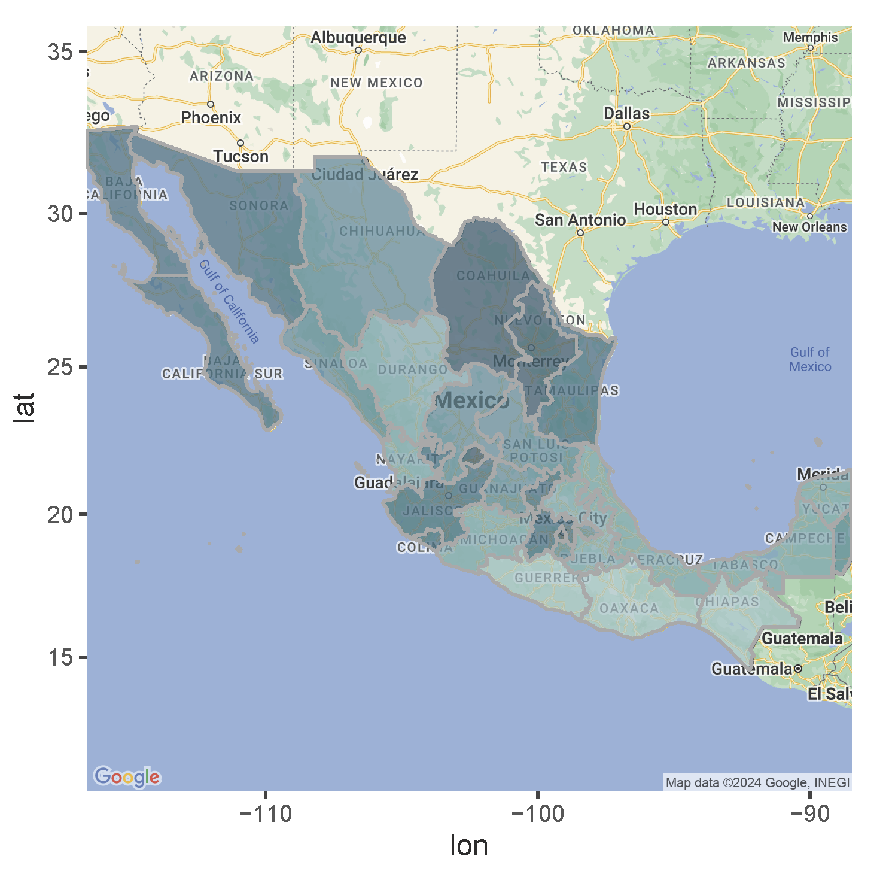{width="70%" fig-align="center"}  

**Caso particular**  

```{r, class.source = "fold-hide"}
#Paquetes
require(ggimage) # Utiliza la función geom_image
require(grDevices) # Nos permite leer los archivos .svg 

# Se genera un data frame de la ubicación a mapear
location <- data.frame(lon = -100.445009, lat = 20.705260)

get_googlemap(center = c(lon = -100.445009, lat = 20.705260), maptype = "satellite", zoom = 16) %>% 
 ggmap(extent = "normal") +
   geom_point(data = location, mapping = aes(x = -100.445009, 
                                              y = 20.705260)) + 
    geom_image(data = location, mapping = aes(image = "https://upload.wikimedia.org/wikipedia/commons/e/ed/Map_pin_icon.svg", 
                                               x = lon, 
                                                y = lat), 
                size = 0.05) + 
      theme_transparent() + 
       scale_y_continuous(labels = scales::number_format(accuracy = 0.01, decimal.mark = '.')) +
        scale_x_continuous(labels = scales::number_format(accuracy = 0.1, decimal.mark = '.')) +
         labs(x = "", 
               y = "")
```

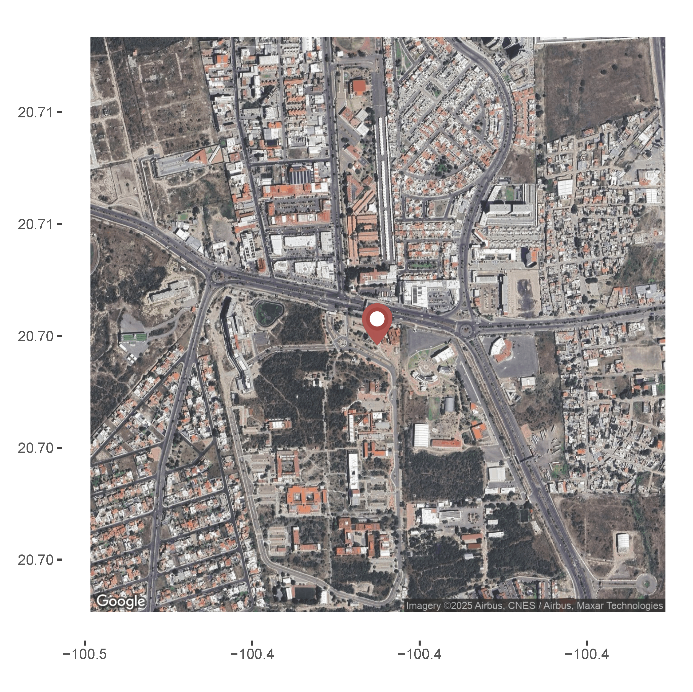{width="70%" fig-align="center"}  

### `geom_polygon`

La función `geom_polygon()` de la paquetería `ggplot2`, devuelve un objeto `ggplot` en el cual dibuja líneas entre puntos y los cierra ( es decir, dibuja una línea desde el último punto hasta el primer punto). En el cual es importante tener en cuenta que el data.frame incluye columnas con la ubicación de las áreas geográficas y se agregan como argumentos en la función `aes(x = long,  y = lat)`. También se incluye una columna que describe el orden en que se deben conectar estos puntos para formar un polígono (`order`), el nombre del estado (`id`) y una columna de grupo que separa los puntos en polígonos únicos que se deben trazar `aes (group = group)`.

```{r, class.source = "fold-hide"}
# Paleta de colores
require(unikn) 

p <- ggplot() + 
      geom_polygon(data = capas_estados,
                    mapping = aes(x = long, 
                                   y = lat, 
                                    group = group,
                                     fill = fct_relevel(GM_2020,"Muy alto","Alto","Medio","Bajo","Muy bajo")),
                     color = "dark grey",
                      size = 0.5) +
        expand_limits(x = capas_estados$long,  
                      y = capas_estados$lat) + 
         theme_transparent() + 
          theme(plot.title = element_text(size = 21, hjust = 0.15, family = "Montserrat", face = "bold"),
                plot.subtitle = element_text(size = 18, hjust = 0, family = "Montserrat Medium"),
                plot.caption = element_text(size = 11, hjust = 0.2, vjust = 1, family = "Montserrat"), 
                axis.text = element_blank(),
                axis.title = element_blank(),
                axis.ticks = element_blank(),
                legend.key.size = unit(0.5, "cm"),
                legend.text = element_text(size = 10, family = "Montserrat"), 
                legend.title = element_text(size = 12, hjust = 0.5, family = "Montserrat", face = "bold"),
                legend.position = c(0.8, 0.7)) + 
           scale_fill_manual(values = rev(usecol(pal = pal_petrol, n = 5))) + 
            scale_color_manual(values = c("#BDBDBD")) +  
             guides(color = guide_legend(override.aes = list(fill = usecol(pal = pal_petrol, n = 5)))) +
       labs(title = "Índice de marginación a nivel estatal, 2020",
            subtitle = "Utilizando geom_polygon()",
             fill = stringr::str_wrap("Grado de marginación", 10),
              caption = expression(paste("Fuentes: Estimaciones del CONAPO con base en el INEGI, Censo de Población y Vivienda 2020")))

#path = "Images/IME_2020_geom_polygon.pdf"
#ggexport(p, width = 8, height = 5, res = 400, filename = path)

p
```

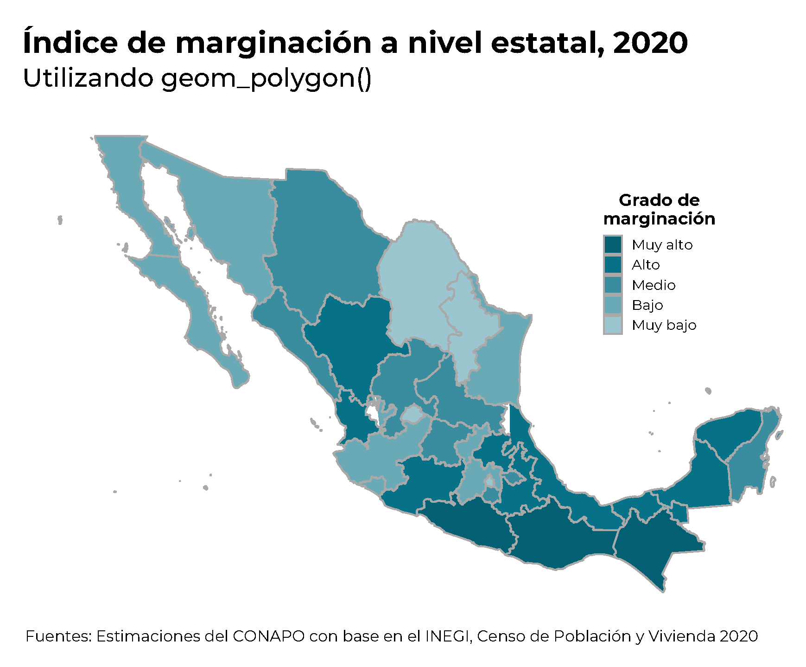{width="70%" fig-align="center"}  

### `tmap`

Con el paquete `tmap` se pueden generar mapas temáticos con gran flexibilidad. La sintaxis para crear gráficos es similar a la de *ggplot2*, pero adaptada a los mapas. Además, ofrece un sistema de trazado coherente para mapas temáticos que se basan en la estructura de las capas en los gráficos. Los mapas temáticos se crean apilando capas, donde cada capa y cada dato se pueden asignar a una o más `aes ()`. También es posible escalarlos y agregando posibles atributos del mapa, como una barra de escala o una brújula.

Una de las ventajas a diferencia de ggplot(), es más rápido de generar los gráficos y permite trabajar con múltiples capas a la vez. Además, permite hacerlo de manera interactiva como un widget HTML.

La función `tm_shape`, crea un elemento que especifica un objeto de `SpatialPolygonsDataFrame`, sin la necesidad de convertir los datos a un data.frame. [GitHub: r-tmap/tmap](https://github.com/r-tmap/tmap)

```{r, fig.width=8,fig.height=5, class.source = "fold-hide"}
# Paquetes 
require(tmap)
require(tmaptools)

p <- tm_shape(layer_estados) + 
      tm_polygons("GM_2020", 
                  title = "Grado de \n marginación",
                  palette = "BuPu", 
                  na.show = FALSE,
                  ) + 
       tm_borders(col = "grey", lwd = 0.5) + 
        tm_layout(title = "Índice de marginación a nivel estatal, 2020",
                    title.fontfamily = "Montserrat",
                    title.fontface = "bold",
                    title.size = 2,
                    title.position = c("center", "top"), 
                    main.title.fontface = "bold",
                    main.title.position = c("center", "top"),
                    main.title.size = 7, 
                    main.title.fontfamily = "Montserrat",
                    legend.outside = TRUE,
                    legend.outside.position = c("center", "right"),
                    legend.title.fontfamily = "Montserrat",
                    legend.na.show = FALSE,
                    legend.title.fontface = "bold", 
                    legend.text.fontfamily = "Montserrat",
                    legend.title.size = 1, 
                    legend.text.size = 0.8, 
                    legend.frame = FALSE,
                    fontfamily = "Montserrat",
                    frame = FALSE) + 
          tm_credits(expression(paste("Fuentes: Estimaciones del CONAPO con base en el INEGI, Censo de Población y Vivienda 2020")),
                      position=c("left", "bottom"), 
                       size = 1.1)
     
#path = "Images/IME_2020_tmap.pdf"
#ggexport(p, width = 8, height = 5, res = 400, filename = path)

p
```

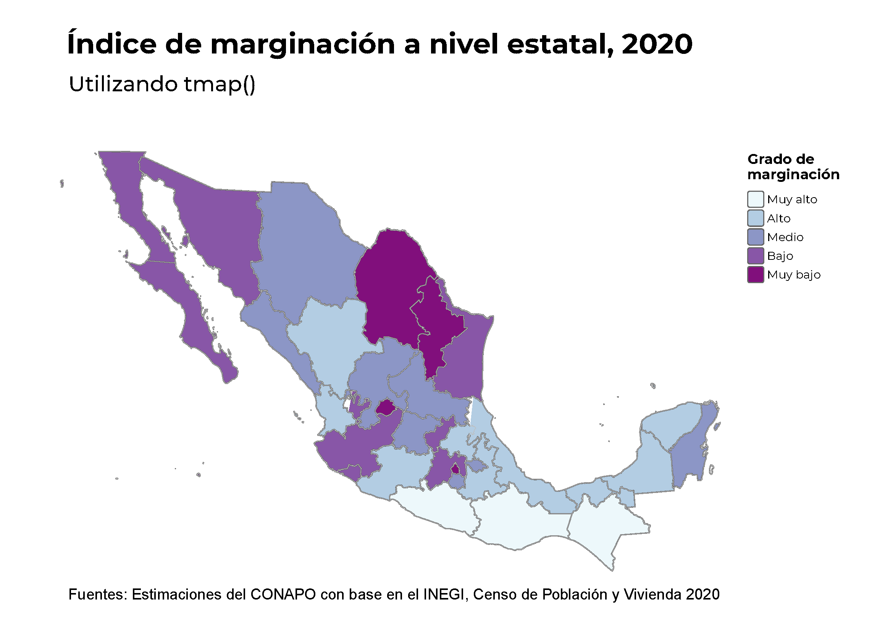{width="90%" fig-align="center"}  

### `ggspatial`

Cualquier capa espacial se puede agregar a un `ggplot()` usando la función `layer_spatial()` del paquete `ggspatial` (bueno, cualquier objeto de los paquetes `sf`, `sp` o `raster`...). Estas capas entrenarán las escalas y a diferencia de las funciones `geom_` o `stat_`, `layer_spatial()` siempre toma sus datos primero sin necesidad de especificar los límites de las escalas. [Estructura ggspatial](https://paleolimbot.github.io/ggspatial/articles/ggspatial.html).

```{r, class.source = "fold-hide"}
# Paquete 
require(ggspatial)

paleta <- colorRampPalette(pals::kovesi.linear_bmy_10_95_c78(10))(5)

p <- ggplot() + 
      layer_spatial(layer_estados, aes(fill = GM_2020)) + 
       theme_transparent() + 
        theme(plot.title = element_text(size = 21, hjust = 0.15, family = "Montserrat", face = "bold"),
              plot.subtitle = element_text(size = 18, hjust = 0, family = "Montserrat Medium"),
              plot.caption = element_text(size = 11, hjust = 0.2, vjust = 1, family = "Montserrat"), 
              axis.text = element_blank(),
              axis.title = element_blank(),
              axis.ticks = element_blank(),
              legend.key.size = unit(0.5, "cm"),
              legend.text = element_text(size = 10, family = "Montserrat"), 
              legend.title = element_text(size = 12, hjust = 0.5, family = "Montserrat", face = "bold"),
              legend.position = c(0.8, 0.7)) + 
         scale_fill_manual(values = paleta) +
          scale_color_manual(values = c("#BDBDBD")) + 
           guides(color = guide_legend(override.aes = list(fill = usecol(pal = pal_petrol, n = 5)))) +
     labs(title = "Índice de marginación a nivel estatal, 2020",
           subtitle = "Utilizando ggspatial()",
            fill = stringr::str_wrap("Grado de marginación", 10), 
             caption = expression(paste("Fuentes: Estimaciones del CONAPO con base en el INEGI, Censo de Población y Vivienda 2020")))

#path = "Images/IME_2020_ggspatial.pdf"
#ggexport(p, width = 8, height = 5, res = 400, filename = path)

p
```


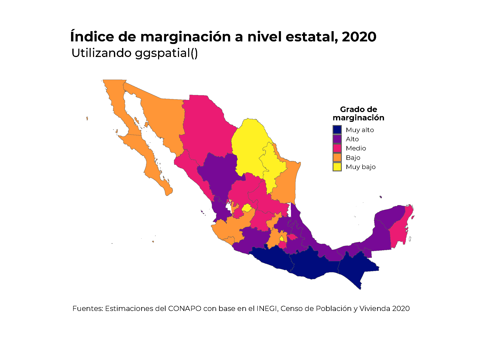{width="90%" fig-align="center"}  

### `geom_sf`

Conversión de datos: `st_as_sf`, convierte un objeto externo en un spatial object.

Los objetos espaciales creados por el paquete `sp` (que hasta hace poco era la forma estándar de manejar datos espaciales en `R)` se pueden formatear en un formato de características simples usando la función `st_as_sf()`:

```{r, eval = FALSE, class.source = "fold-show"}
#Paquetes
require(sf)
estados_sf <- st_as_sf(capas_estados, 
                        coords = c("long","lat"),
                         crs = "+proj=lcc +lat_0=12 +lon_0=-102 +lat_1=17.5 +lat_2=29.5 +x_0=2500000 +y_0=0 +ellps=GRS80 +units=m +no_defs") 
```

A continuación, se muestra un ejemplo de cómo visualizar objetos `sf`. Este tipo de función es un poco más amigable de usar.

La función `as_tibble` de la paquetería `tibble`, genera una base de datos genérica de S3 con métodos más eficientes para matrices y data.frame. Su envoltorio delgado permite trabajar de manera más rápida que un `data.frame`.

```{r, class.source = "fold-hide"}
# Paquetes 
require(ggplot2)
require(tibble)
require(sf)

paleta <- rev(colorRampPalette(pals::brewer.seqseq1(10))(5))

p <- ggplot(data = tbl_estados) +  
      geom_sf(mapping = aes(geometry = geometry, 
                             fill = fct_relevel(GM_2020,"Muy alto","Alto","Medio","Bajo","Muy bajo")),
               color = "#BDBDBD", 
                size = 0.1)  + 
       theme_transparent() + 
        theme(plot.title = element_text(size = 21, hjust = 0.15, family = "Montserrat", face = "bold"),
              plot.subtitle = element_text(size = 18, hjust = 0, family = "Montserrat Medium"),
              plot.caption = element_text(size = 11, hjust = 0.2, vjust = 1, family = "Montserrat"), 
              axis.text = element_blank(),
              axis.title = element_blank(),
              axis.ticks = element_blank(),
              legend.key.size = unit(0.5, "cm"),
              legend.text = element_text(size = 10, family = "Montserrat"), 
              legend.title = element_text(size = 12, hjust = 0.5, family = "Montserrat", face = "bold"),
              legend.position = c(0.8, 0.7)) + 
          scale_fill_manual(values = paleta) + 
           scale_color_manual(values = paleta) + 
            guides(color = guide_legend(override.aes = list(fill = rev(usecol(pal = pal_petrol, n = 5))))) +
      labs(title = "Índice de marginación a nivel estatal, 2020",
           subtitle = "Utilizando geom_sf()",
            fill = stringr::str_wrap("Grado de marginación", 10),
             caption = expression(paste("Fuentes: Estimaciones del CONAPO con base en el INEGI, Censo de Población y Vivienda 2020")))

#path = "Images/IME_2020_geom_sf.pdf"
#ggexport (p, width = 8, height = 5, res = 400, filename = path)

p
```

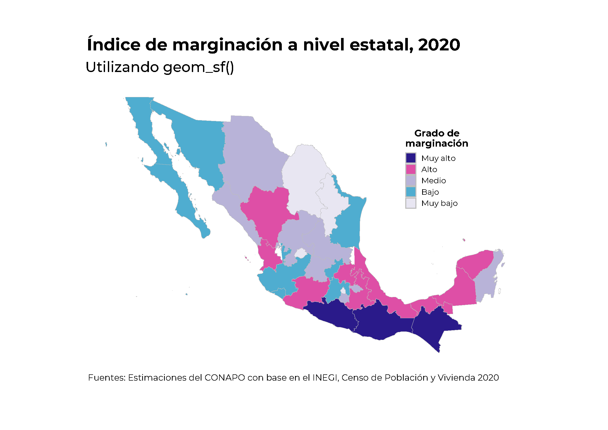{width="90%" fig-align="center"}   


## Municipio {.tabset .tabset-fade .tabset-pills}

### `geom_map`

La función `ggmap()` devuelve un objeto `ggplot`. Puede usar este objeto `ggplot` resultante como lo haría con cualquier otro objeto ggplot (ejemplo, agregar geoms, cambiar tema). [GitHub: fresques/ggmap](https://github.com/fresques/ggmap)

Una de las bondades del paquete `ggmap`, permite hacer mediante el uso de herramientas de *Google Maps* directamente desde `R`. Este paquete permite extraer un mapa base de *Google Maps* y algunos otros servidores de mapas, para que luego se puedan trazar y agregar puntos, polígonos, líneas y otros elementos usando funciones `ggplot2`. Este paquete usa la `API` de *Google Maps*. Otras funciones en el paquete `ggmap`, necesita una clave `API` de Google Maps para que funcione.

```{r, class.source = "fold-hide"}
p <- IMM_2020 %>% 
      mutate(GM_2020 = fct_relevel(.$GM_2020,"Muy alto", "Alto", "Medio", "Bajo", "Muy bajo")) %>%
       ggplot() + 
        geom_map(map = capas_municipios, 
                  aes(map_id = CVE_GEO, fill = GM_2020), 
                   color = 'transparent')  +
         geom_polygon(capas_estados,
                       mapping = aes(x = long, 
                                     y = lat, 
                                     group = group),
                       color = "dark grey",
                       fill = "transparent",
                       size = 0.6) +
           expand_limits(x = capas_municipios$long, y = capas_municipios$lat) + 
            theme_transparent() + 
             theme(plot.title = element_text(size = 21, hjust = 0.15, family = "Montserrat", face = "bold"),
                   plot.subtitle = element_text(size = 18, hjust = 0, family = "Montserrat Medium"),
                   plot.caption = element_text(size = 11, hjust = 0.2, vjust = 1, family = "Montserrat"), 
                   axis.text = element_blank(),
                   axis.title = element_blank(),
                   axis.ticks = element_blank(),
                   legend.key.size = unit(0.5, "cm"),
                   legend.text = element_text(size = 10, family = "Montserrat"), 
                   legend.title = element_text(size = 12, hjust = 0.5, family = "Montserrat", face = "bold"),
                   legend.position = c(0.8, 0.7)) + 
              scale_fill_viridis_d(option = "A", begin = 0.3, end = 0.8) + 
               scale_color_manual(values = c("#BDBDBD")) +  
                guides(color = 'none') +
          labs(title = "Índice de marginación a nivel municipal, 2020",
                subtitle = "Utilizando ggmap()",
                 fill = stringr::str_wrap("Grado de marginación", 10),
                  caption = expression(paste("Fuentes: Estimaciones del CONAPO con base en el INEGI, Censo de Población y Vivienda 2020")))

#path = "Images/IMM_2020_gmap.pdf"
#ggexport(p, width = 8, height = 5, res = 400, filename = path)

p
```

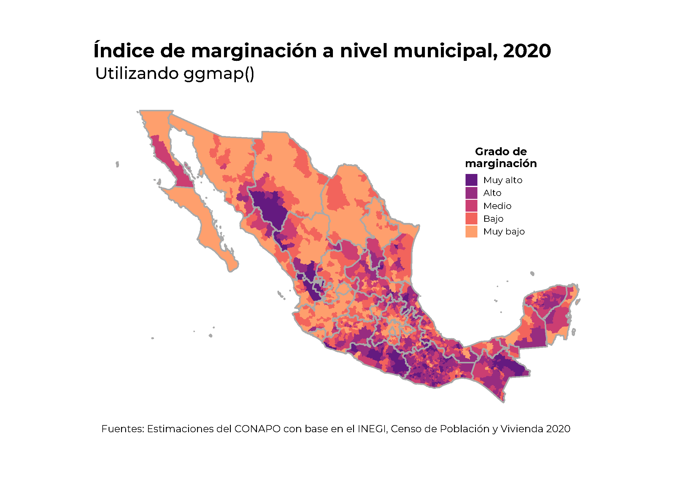{width="90%" fig-align="center"}  

### `geom_polygon`

La función `geom_polygon()` de la paquetería `ggplot2`, devuelve un objeto `ggplot` en el cual dibuja líneas entre puntos y los cierra ( es decir, dibuja una línea desde el último punto hasta el primer punto). En el cual es importante tener en cuenta que el data.frame incluye columnas con la ubicación de las áreas geográficas y se agregan como argumentos en la función `aes(x = long,  y = lat)`. También se incluye una columna que describe el orden en que se deben conectar estos puntos para formar un polígono (`order`), el nombre del municipio (`id`) y una columna de grupo que separa los puntos en polígonos únicos que se deben trazar `aes (group = group)`.

```{r, class.source = "fold-hide"}
# Paleta de colores
require(unikn) 

p <- ggplot() + 
      geom_polygon(capas_municipios,
                    mapping = aes(x = long, 
                                  y = lat, 
                                  group = group, 
                                  fill = fct_relevel(GM_2020, "Muy alto", "Alto", "Medio", "Bajo", "Muy bajo")),
                     color = "transparent",  
                      size = .15,
                       alpha = 0.9) +
      geom_polygon(capas_estados,
                    mapping = aes(x = long, 
                                  y = lat, 
                                  group = group),
                     color = "dark grey",
                      fill = "transparent",
                       size = 0.6) +
       coord_equal() +
        theme_transparent() + 
             theme(plot.title = element_text(size = 21, hjust = 0.15, family = "Montserrat", face = "bold"),
                   plot.subtitle = element_text(size = 18, hjust = 0, family = "Montserrat Medium"),
                   plot.caption = element_text(size = 11, hjust = 0.2, vjust = 1, family = "Montserrat"), 
                   axis.text = element_blank(),
                   axis.title = element_blank(),
                   axis.ticks = element_blank(),
                   legend.key.size = unit(0.5, "cm"),
                   legend.text = element_text(size = 10, family = "Montserrat"), 
                   legend.title = element_text(size = 12, hjust = 0.5, family = "Montserrat", face = "bold"),
                   legend.position = c(0.8, 0.7)) + 
              scale_fill_manual(values = rev(usecol(pal = pal_petrol, n = 5))) + 
               scale_color_manual(values = c("#BDBDBD")) +  
                guides(color = 'none') +
          labs(title = "Índice de marginación a nivel municipal, 2020",
                subtitle = "Utilizando geom_polygon()",
                 fill = stringr::str_wrap("Grado de marginación", 10),
                  caption = expression(paste("Fuentes: Estimaciones del CONAPO con base en el INEGI, Censo de Población y Vivienda 2020")))

#path = "Images/IMM_2020_geom_polygon.pdf"
#ggexport(p, width = 8, height = 5, res = 400, filename = path)

p
```

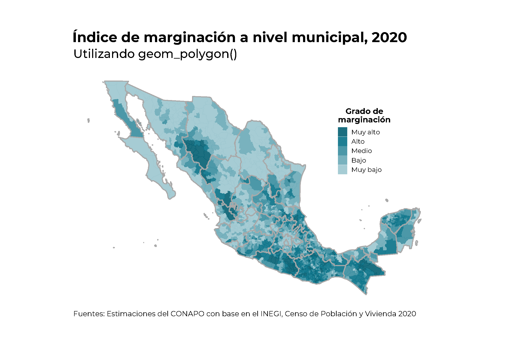{width="90%" fig-align="center"}  

### `tmap`

Con el paquete `tmap` se pueden generar mapas temáticos con gran flexibilidad. La sintaxis para crear gráficos es similar a la de *ggplot2*, pero adaptada a los mapas. Además, ofrece un sistema de trazado coherente para mapas temáticos que se basan en la estructura de las capas en los gráficos. Los mapas temáticos se crean apilando capas, donde cada capa y cada dato se pueden asignar a una o más `aes ()`. También es posible escalarlos y agregando posibles atributos del mapa, como una barra de escala o una brújula.

Una de las ventajas a diferencia de ggplot(), es más rápido de generar los gráficos y permite trabajar con múltiples capas a la vez. Además, permite hacerlo de manera interactiva como un widget HTML.

La función `tm_shape`, crea un elemento que especifica un objeto de `SpatialPolygonsDataFrame`, sin la necesidad de convertir los datos a un data.frame. [GitHub: r-tmap/tmap](https://github.com/r-tmap/tmap)

```{r, fig.width=8, fig.height=8, class.source = "fold-hide"}
# Paquetes
require(tmap)
require(tmaptools)
require(sf)

paleta <- rev(colorRampPalette(pals::brewer.bupu(10))(6))
paleta <- c("#4D004B", "#832C8E", "#8B73B4", "#9CB1D4", "#CBDCEB")

p <- tm_shape(layer_municipios, id = "CVE_GEO") +
      tm_polygons("GM_2020",
                   title = stringr::str_wrap("Grado de marginación", 10),
                    palette = paleta,
                     border.col = NA
                  ) + 
       tm_shape(st_as_sf(layer_estados), is.master = TRUE) +
        tm_borders(col = "grey", lwd = 1) +
          tm_layout(title = "Índice de marginación a nivel municipal, 2020",
                    title.fontfamily = "Montserrat",
                    title.fontface = "bold",
                    title.size = 2,
                    title.position = c("center", "top"), 
                    main.title.fontface = "bold",
                    main.title.position = c("center", "top"),
                    main.title.size = 7, 
                    main.title.fontfamily = "Montserrat",
                    legend.outside = TRUE,
                    legend.outside.position = c("center", "right"),
                    legend.title.fontfamily = "Montserrat",
                    legend.na.show = FALSE,
                    legend.title.fontface = "bold", 
                    legend.text.fontfamily = "Montserrat",
                    legend.title.size = 1, 
                    legend.text.size = 0.8, 
                    legend.frame = FALSE,
                    fontfamily = "Montserrat",
                    frame = FALSE) + 
            tm_credits(expression(paste("Fuentes: Estimaciones del CONAPO con base en el INEGI, Censo de Población y Vivienda 2020")),
                        position = c("left", "bottom"), 
                         size = 1.1) 
     
#path = "Images/IMM_2020_tmap.pdf"
#ggexport(p, width = 8, height = 5, res = 400, filename = path)

p
```

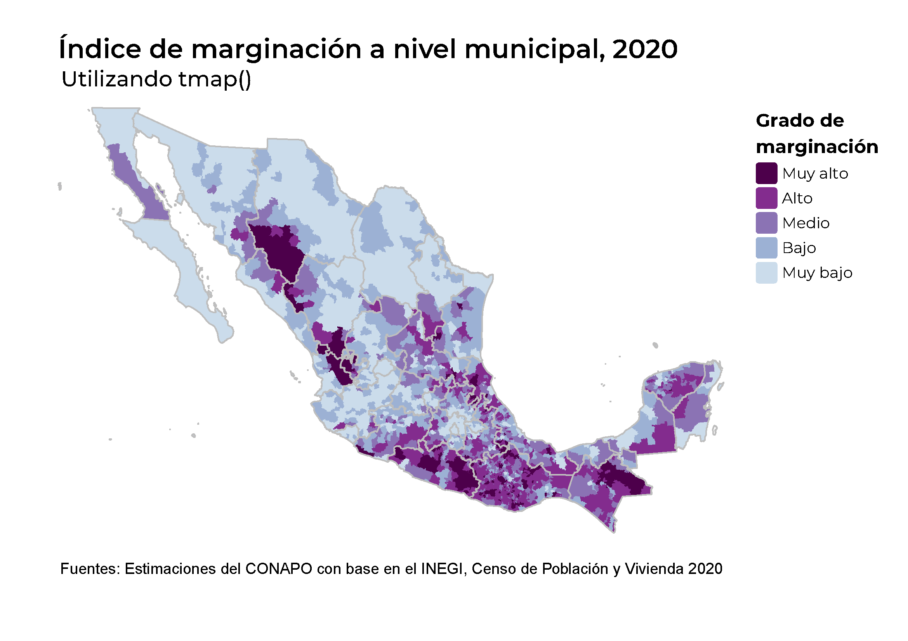{width="90%" fig-align="center"}  

### `geom_sf`

A continuación, se muestra un ejemplo de cómo visualizar objetos `sf`. Este tipo de función es un poco más amigable de usar.

La función `as_tibble` de la paquetería `tibble`, genera una base de datos genérica de S3 con métodos más eficientes para matrices y data.frame. Su envoltorio delgado permite trabajar de manera más rápida que un `data.frame`.

```{r, class.source = "fold-hide"}
# Paquetes
require(ggplot2)
require(tibble)
require(sf) 

# Paleta  
paleta <- rev(colorRampPalette(pals::brewer.seqseq1(20))(5))

p <- ggplot() +
      geom_sf(data = tbl_municipios,
               mapping = aes(geometry = geometry, 
                             fill = fct_relevel(GM_2020, "Muy alto", "Alto", "Medio", "Bajo", "Muy bajo"),
                             color = fct_relevel(GM_2020, "Muy alto", "Alto", "Medio", "Bajo","Muy bajo")),
                  size = 0.1) + 
       geom_sf(data = tbl_estados,
                mapping = aes(geometry = geometry), 
                 fill = 'transparent',
                  color = "black") +
        coord_sf() +
         theme_transparent() + 
          theme(plot.title = element_text(size = 21, hjust = 0.15, family = "Montserrat", face = "bold"),
                plot.subtitle = element_text(size = 18, hjust = 0, family = "Montserrat Medium"),
                plot.caption = element_text(size = 11, hjust = 0.2, vjust = 1, family = "Montserrat"), 
                axis.text = element_blank(),
                axis.title = element_blank(),
                axis.ticks = element_blank(),
                legend.key.size = unit(0.5, "cm"),
                legend.text = element_text(size = 10, family = "Montserrat"), 
                legend.title = element_text(size = 12, hjust = 0.5, family = "Montserrat", face = "bold"),
                legend.position = c(0.8, 0.7)) + 
          scale_fill_manual(values = paleta) + 
           scale_color_manual(values = paleta) +  
            guides(color = 'none') +
          labs(title = "Índice de marginación a nivel municipal, 2020",
                subtitle = "Utilizando geom_sf()",
                 fill = stringr::str_wrap("Grado de marginación", 10),
                  caption = expression(paste("Fuentes: Estimaciones del CONAPO con base en el INEGI, Censo de Población y Vivienda 2020")))
#path = "Images/IMM_2020_geom_sf.pdf"
#ggexport(p, width = 8, height = 5, res = 400, filename = path)

p
```

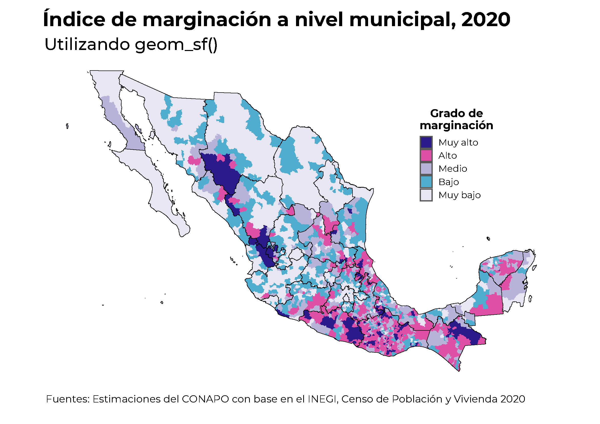{width="90%" fig-align="center"}  

## Localidad {.tabset .tabset-fade .tabset-pills}  

### `geom_map`

La función `ggmap()` devuelve un objeto `ggplot`. Puede usar este objeto `ggplot` resultante como lo haría con cualquier otro objeto ggplot (ejemplo, agregar geoms, cambiar tema). [GitHub: fresques/ggmap](https://github.com/fresques/ggmap)

Una de las bondades del paquete `ggmap`, permite hacer mediante el uso de herramientas de *Google Maps* directamente desde `R`. Este paquete permite extraer un mapa base de *Google Maps* y algunos otros servidores de mapas, para que luego se puedan trazar y agregar puntos, polígonos, líneas y otros elementos usando funciones `ggplot2`. Este paquete usa la `API` de *Google Maps*. Otras funciones en el paquete `ggmap`, necesita una clave `API` de Google Maps para que funcione.

```{r, class.source = "fold-hide"}

p <- IML_2020 %>% 
      mutate(GM_2020 = fct_relevel(.$GM_2020,"Muy alto", "Alto", "Medio", "Bajo", "Muy bajo")) %>%
       ggplot() + 
        geom_map(map = capas_localidad, 
                  aes(map_id = CVE_GEO, fill = GM_2020), 
                   color = 'transparent')  +
         geom_point(capas_localidad_p, 
                      mapping = aes(x = lon, 
                                    y = lat, 
                                    color = GM_2020),
                     size = 0.001)  +
         geom_polygon(capas_estados,
                       mapping = aes(x = long, 
                                     y = lat, 
                                     group = group),
                       color = "dark grey",
                       fill = "transparent",
                       size = 0.6) +
           expand_limits(x = capas_localidad$long, y = capas_localidad$lat) + 
            theme_transparent() + 
             theme(plot.title = element_text(size = 21, hjust = 0.15, family = "Montserrat", face = "bold"),
                   plot.subtitle = element_text(size = 18, hjust = 0, family = "Montserrat Medium"),
                   plot.caption = element_text(size = 11, hjust = 0.2, vjust = 1, family = "Montserrat"), 
                   axis.text = element_blank(),
                   axis.title = element_blank(),
                   axis.ticks = element_blank(),
                   legend.key.size = unit(0.5, "cm"),
                   legend.text = element_text(size = 10, family = "Montserrat"), 
                   legend.title = element_text(size = 12, hjust = 0.5, family = "Montserrat", face = "bold"),
                   legend.position = c(0.8, 0.7)) + 
              scale_fill_viridis_d(option = "A", begin = 0.3, end = 0.8) + 
               scale_color_viridis_d(option = "A", begin = 0.3, end = 0.8) + 
                guides(color = 'none') +
          labs(title = "Índice de marginación a nivel localidad, 2020",
                subtitle = "Utilizando ggmap()",
                 fill = stringr::str_wrap("Grado de marginación", 10),
                  caption = expression(paste("Fuentes: Estimaciones del CONAPO con base en el INEGI, Censo de Población y Vivienda 2020")))

#path = "Images/IML_2020_gmap.pdf"
#ggexport(p, width = 8, height = 5, res = 400, filename = path)

p
```

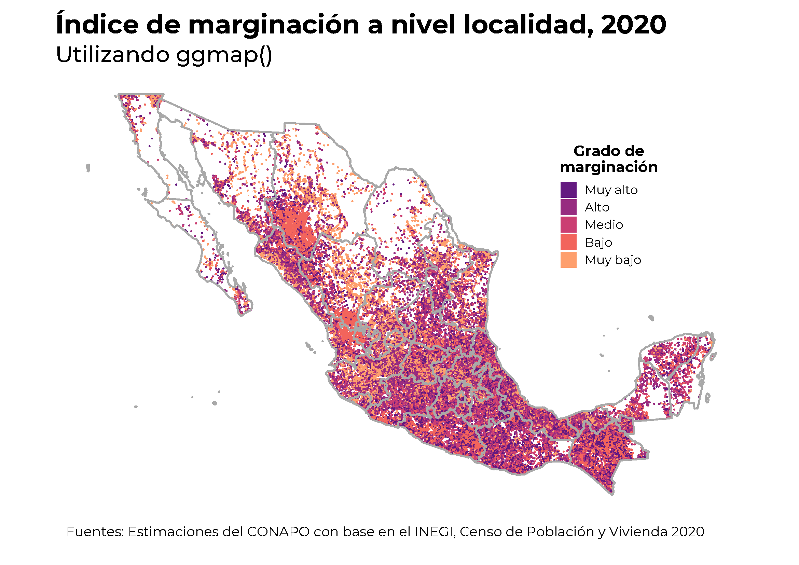{width="90%" fig-align="center"}  

### `geom_polygon`

La función `geom_polygon()` de la paquetería `ggplot2`, devuelve un objeto `ggplot` en el cual dibuja líneas entre puntos y los cierra ( es decir, dibuja una línea desde el último punto hasta el primer punto). En el cual es importante tener en cuenta que el data.frame incluye columnas con la ubicación de las áreas geográficas y se agregan como argumentos en la función `aes(x = long,  y = lat)`. También se incluye una columna que describe el orden en que se deben conectar estos puntos para formar un polígono (`order`), el nombre de la localidad (`id`) y una columna de grupo que separa los puntos en polígonos únicos que se deben trazar `aes (group = group)`.

```{r, class.source = "fold-hide"}
p <- ggplot() + 
      geom_polygon(capas_localidad,
                    mapping = aes(x = long, 
                                  y = lat, 
                                  group = group, 
                                  fill = fct_relevel(GM_2020, "Muy alto","Alto","Medio","Bajo","Muy bajo"), 
                                  color = fct_relevel(GM_2020, "Muy alto", "Alto", "Medio", "Bajo", "Muy bajo")),
                     size = .15) +
       geom_point(capas_localidad_p,
                   mapping = aes(x = lon, 
                                 y = lat, 
                                 color = fct_relevel(GM_2020, "Muy alto", "Alto", "Medio", "Bajo", "Muy bajo")),
                    size = .01,
                     alpha = 0.9) +
        geom_polygon(capas_estados,
                      mapping = aes(x = long, 
                                    y = lat,  
                                    group = group), 
                       fill = 'transparent',
                        color = "grey", 
                         size = 1) +
         coord_equal()  + 
          theme_transparent() + 
           theme(plot.title = element_text(size = 21, hjust = 0.15, family = "Montserrat", face = "bold"),
                 plot.subtitle = element_text(size = 18, hjust = 0, family = "Montserrat Medium"),
                 plot.caption = element_text(size = 11, hjust = 0.2, vjust = 1, family = "Montserrat"), 
                 axis.text = element_blank(),
                 axis.title = element_blank(),
                 axis.ticks = element_blank(),
                 legend.key.size = unit(0.5, "cm"),
                 legend.text = element_text(size = 10, family = "Montserrat"), 
                 legend.title = element_text(size = 12, hjust = 0.5, family = "Montserrat", face = "bold"),
                 legend.position = c(0.8, 0.7)) + 
            scale_fill_manual(values = rev(usecol(pal = pal_petrol, n = 5))) + 
             scale_color_manual(values = rev(usecol(pal = pal_petrol, n = 5))) + 
             guides(color = 'none') +
      labs(title = "Índice de marginación a nivel localidad, 2020",
            subtitle = "Utilizando geom_polygon()",
            fill = stringr::str_wrap("Grado de marginación", 10),
             caption = expression(paste("Fuentes: Estimaciones del CONAPO con base en el INEGI, Censo de Población y Vivienda 2020")))

#path = "Images/IML_2020_geom_polygon.pdf"
#ggexport (p, width = 8, height = 5, res = 400, filename = path)

p
```

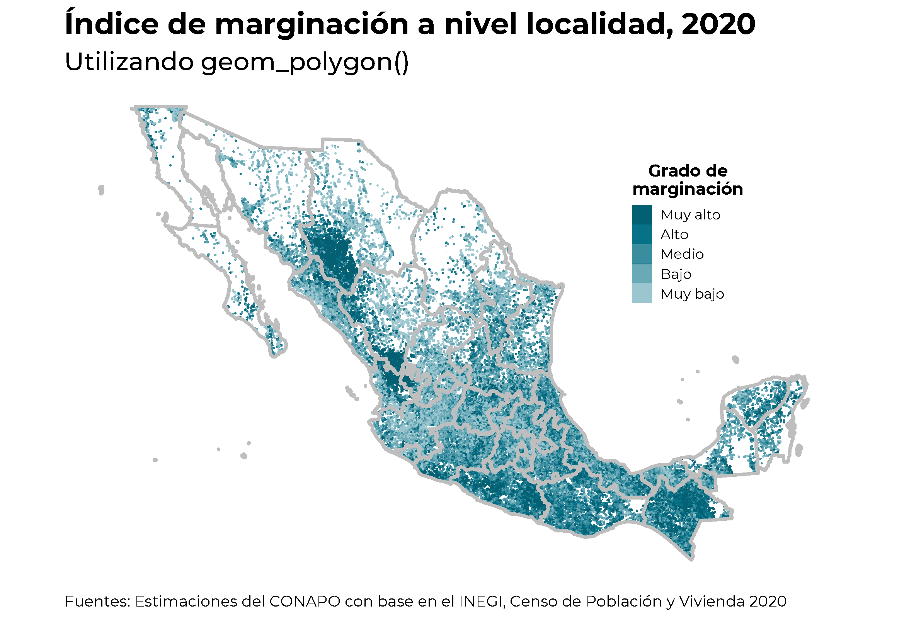{width="90%" fig-align="center"}  

#### Por estados 

Se implementa una función para visualizar la distribución geográfica de las localidades, tanto a nivel estatal como municipal, lo que permite un análisis detallado de su distribución territorial en todo el país. Para efectos demostrativos, se utiliza como ejemplo el estado de Querétaro, específicamente el municipio de San Juan del Río.

```{r Localidad_por_estado, class.source = "fold-hide"}
# Clave única de estados 
estados <- unique(IML_2020$ENT)
nom_ent <- unique(IML_2020$NOM_ENT)

p <- NULL 
q <- NULL
#for(i in 1:32){
for(i in 22){
  
municipio <- IML_2020 %>% 
              mutate(CVE_MUN = paste0(ENT, MUN)) %>%
               filter(ENT == estados[i]) %>% 
                dplyr::select(CVE_MUN) %>%
                 unique()

nom_mun <- IML_2020 %>% 
            filter(ENT == estados[i]) %>% 
             dplyr::select(NOM_MUN) %>%
               unique()

p[[i]] <- ggplot() + 
           geom_polygon(capas_estados %>% filter(id == estados[i]),
                         mapping = aes(x = long, 
                                       y = lat, 
                                       group = group), 
                          fill = 'transparent',
                           color = "black", 
                            size = .5,
                             alpha = 1) +
           geom_polygon(capas_municipios %>% filter(CVE_ENT == estados[i]),
                         mapping = aes(x = long, 
                                       y = lat, 
                                       group = group), 
                          fill = 'transparent',
                           color = "#7A7A7A", 
                            size = .2,
                             alpha = 0.9) +
           geom_polygon(capas_localidad %>% filter(ENT == estados[[i]]),
                         mapping = aes(x = long, 
                                       y = lat, 
                                       group = group, 
                                       fill = fct_relevel(GM_2020, "Muy alto", "Alto", "Medio", "Bajo", "Muy bajo"),
                                       color = fct_relevel(GM_2020, "Muy alto", "Alto", "Medio", "Bajo", "Muy bajo")),
                         size = 0.5,
                         alpha = 0.6) +
           geom_point(capas_localidad_p %>% filter(ENT == estados[[i]]),
                       mapping = aes(x = lon, 
                                     y = lat, 
                                     fill = fct_relevel(GM_2020, "Muy alto", "Alto", "Medio", "Bajo", "Muy bajo"),
                                     color = fct_relevel(GM_2020, "Muy alto", "Alto", "Medio", "Bajo", "Muy bajo")),
                        size = 0.01,
                        alpha = 0.8) +
             coord_equal() +
              theme_transparent() + 
               theme(plot.title = element_text(size = 21, hjust = 0.15, family = "Montserrat", face = "bold"),
                     plot.subtitle = element_text(size = 18, hjust = 0, family = "Montserrat Medium"),
                     plot.caption = element_text(size = 11, hjust = 0.2, vjust = 1, family = "Montserrat"), 
                     axis.text = element_blank(),
                     axis.title = element_blank(),
                     axis.ticks = element_blank(),
                     legend.key.size = unit(0.5, "cm"),
                     legend.text = element_text(size = 10, family = "Montserrat"), 
                     legend.title = element_text(size = 12, hjust = 0.5, family = "Montserrat", face = "bold"),
                     legend.position = "bottom") + 
                scale_fill_viridis_d(option = "A", begin = 0.3, end = 0.8) + 
                 scale_color_viridis_d(option = "A", begin = 0.3, end = 0.8) + 
                  guides(color = 'none', 
                         fill = guide_legend(override.aes = list(alpha = 1))) +
          labs(title = stringr::str_wrap(paste(nom_ent[i], ": índice de marginación a nivel localidad, 2020"), 80),
                fill = stringr::str_wrap("Grado de marginación", 10),
                 #caption = expression(paste("Fuentes: Estimaciones del CONAPO con base en el INEGI, Censo de Población y Vivienda 2020"))
               )

for(j in 1:nrow(municipio)){
  
q[[j]] <- ggplot() + 
           geom_polygon(data = capas_municipios %>% filter(id == municipio$CVE_MUN[j]), 
                         mapping = aes(x = long, 
                                       y = lat, 
                                       group = group), 
                          fill = 'transparent',
                           color="black", 
                            size = .5,
                             alpha = 0.9) +
           geom_polygon(data = capas_localidad %>% 
                                 mutate(CVE_MUN = paste0(ENT, MUN)) %>% 
                                  filter(CVE_MUN == municipio$CVE_MUN[j]),
                         mapping = aes(x = long, 
                                       y = lat, 
                                       group = group, 
                                       fill = fct_relevel(GM_2020, "Muy alto", "Alto", "Medio", "Bajo", "Muy bajo"),
                                       color = fct_relevel(GM_2020, "Muy alto", "Alto", "Medio", "Bajo", "Muy bajo")),
                          size = 0.8,
                          alpha = 1) +
           geom_point(capas_localidad_p %>% 
                       mutate(CVE_MUN = paste0(ENT, MUN)) %>% 
                        filter(CVE_MUN == municipio$CVE_MUN[j]),
                         mapping = aes(x = lon, 
                                       y = lat, 
                                       fill = fct_relevel(GM_2020, "Muy alto", "Alto", "Medio", "Bajo", "Muy bajo"),
                                       color = fct_relevel(GM_2020, "Muy alto", "Alto", "Medio", "Bajo", "Muy bajo")),
                         size = 0.8,
                         alpha = 0.5) +
             coord_equal() +
             theme_transparent() + 
              theme(plot.title = element_text(size = 21, hjust = 0.15, family = "Montserrat", face = "bold"),
                    plot.subtitle = element_text(size = 18, hjust = 0, family = "Montserrat Medium"),
                    plot.caption = element_text(size = 11, hjust = 0.2, vjust = 1, family = "Montserrat"), 
                    axis.text = element_blank(),
                    axis.title = element_blank(),
                    axis.ticks = element_blank(),
                    legend.key.size = unit(0.5, "cm"),
                    legend.text = element_text(size = 10, family = "Montserrat"), 
                    legend.title = element_text(size = 12, hjust = 0.5, family = "Montserrat", face = "bold"),
                    legend.position = "right") + 
                scale_fill_viridis_d(option = "A", begin = 0.3, end = 0.8) + 
                 scale_color_viridis_d(option = "A", begin = 0.3, end = 0.8) + 
                  guides(color = 'none', fill = "none") + 
           labs(title = str_wrap(paste(nom_mun$NOM_MUN[j]),50),
                 fill = stringr::str_wrap("Grado de marginación", 10))
  }
}

# Se genera un gráfico con su estado y municipio 

### Se extrae la estructura de  la legenda del gráfico de entidad 

legend <- get_legend(p[[22]] + theme(legend.key.size = unit(0.5, "cm"),
                                      legend.text = element_text(size = 14, family = "Montserrat"), 
                                       legend.title = element_text(size = 16, hjust = 0.5, family = "Montserrat", face = "bold"),                                legend.position = "right"))

tabla <- lapply(1:nrow(municipio), function(x){
                                      ggarrange(p[[22]] + guides(fill = 'none') + labs(title = ""),
                                                 q[[x]], 
                                                  legend , 
                                                    ncol = 3, nrow = 1,
                                                     widths = c(1, 1, 0.5),
                                                      heights = c(1, 0.3, 1))
})

### Se generan los títulos y los pie de página del gráfico 

tabla <- lapply(1:nrow(municipio), function(x){
                                     annotate_figure(tabla[[x]], 
                                                     top = text_grob(stringr::str_wrap(paste(nom_ent[22], ": índice de marginación a nivel localidad, 2020"), 50),
                                                                     family = "Montserrat", 
                                                                     face = "bold", 
                                                                     size = 22), 
                                                     bottom = text_grob(expression(paste("Fuentes: Estimaciones del CONAPO con base en el INEGI, Censo de Población y Vivienda 2020")),
                                                                     family = "Montserrat", 
                                                                     face = "plain", 
                                                                     size = 12,
                                                                     hjust = 0.5))
})

#path = "Images/IML_2020_por estado_geom_polygon.pdf"
#ggexport(list = tabla, width = 8, height = 5, res = 400, filename = path)

tabla[[16]]
```

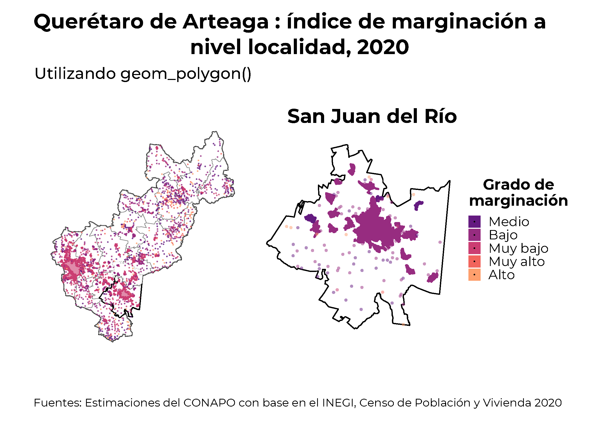{width="90%" fig-align="center"}  

### `tmap`

Con el paquete `tmap` se pueden generar mapas temáticos con gran flexibilidad. La sintaxis para crear gráficos es similar a la de *ggplot2*, pero adaptada a los mapas. Además, ofrece un sistema de trazado coherente para mapas temáticos que se basan en la estructura de las capas en los gráficos. Los mapas temáticos se crean apilando capas, donde cada capa y cada dato se pueden asignar a una o más `aes ()`. También es posible escalarlos y agregando posibles atributos del mapa, como una barra de escala o una brújula.

Una de las ventajas a diferencia de `ggplot()`, es más rápido de generar los gráficos y permite trabajar con múltiples capas a la vez. Además, permite hacerlo de manera interactiva como un widget HTML.

La función `tm_shape`, crea un elemento que especifica un objeto de `SpatialPolygonsDataFrame`, sin la necesidad de convertir los datos a un data.frame. [GitHub: r-tmap/tmap](https://github.com/r-tmap/tmap).  

```{r, fig.width=8, fig.height=8, class.source = "fold-hide"}
# Paquetes
require(tmap)
require(tmaptools)
require(sf)

paleta <- rev(colorRampPalette(pals::brewer.bupu(10))(6))
paleta <- c("#4D004B", "#832C8E", "#8B73B4", "#9CB1D4", "#CBDCEB")

p <- tm_shape(layer_localidad, id = "CVE_GEO") +
      tm_polygons(fill = "GM_2020",
                  fill.legend = tm_legend(title = str_wrap("Grado de marginación", 10)),
                  fill.scale = tm_scale(values = paleta),
                  col = NA  # sin borde
                  ) + 
       tm_shape(st_as_sf(layer_localidad_p), id = "CVE_GEO") +
        tm_dots(fill = "GM_2020",
                fill.legend = tm_legend(title = str_wrap("Grado de marginación", 10)),
                fill.scale = tm_scale(values = paleta),
                legend.show = FALSE,
                size = 0.03
                  ) + 
       tm_shape(st_as_sf(layer_estados), is.master = TRUE) +
        tm_borders(col = "grey", lwd = 1.3) +
          tm_layout(title = "Índice de marginación a nivel localidad, 2020",
                    title.fontfamily = "Montserrat",
                    title.fontface = "bold",
                    title.size = 2,
                    title.position = c("center", "top"), 
                    main.title.fontface = "bold",
                    main.title.position = c("center", "top"),
                    main.title.size = 7, 
                    main.title.fontfamily = "Montserrat",
                    legend.outside = TRUE,
                    legend.outside.position = c("center", "right"),
                    legend.title.fontfamily = "Montserrat",
                    legend.na.show = FALSE,
                    legend.title.fontface = "bold", 
                    legend.text.fontfamily = "Montserrat",
                    legend.title.size = 1, 
                    legend.text.size = 0.8, 
                    legend.frame = FALSE,
                    fontfamily = "Montserrat",
                    frame = FALSE) + 
            tm_credits(expression(paste("Fuentes: Estimaciones del CONAPO con base en el INEGI, Censo de Población y Vivienda 2020")),
                        position = c("left", "bottom"), 
                         size = 1.1) 
     
#path = "Images/IML_2020_tmap.pdf"
#ggexport(p, width = 8, height = 5, res = 400, filename = path)

p
```

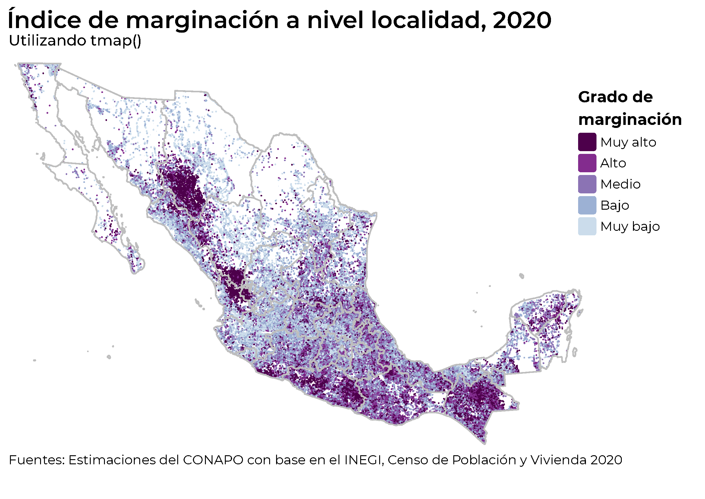{width="90%" fig-align="center"}  

### `geom_sf`

A continuación, se muestra un ejemplo de cómo visualizar objetos `sf`. Este tipo de función es un poco más amigable de usar.

La función `as_tibble` de la paquetería `tibble`, genera una base de datos genérica de S3 con métodos más eficientes para matrices y data.frame. Su envoltorio delgado permite trabajar de manera más rápida que un `data.frame`.

```{r, class.source = "fold-hide"}
require(ggplot2)
require(tibble)
require(sf) 

# Paleta  
paleta <- rev(colorRampPalette(pals::brewer.seqseq1(20))(5))

p <- list()
#for(i in 1:32){
for(i in 7){
  limites <- capas_estados %>%
               filter(id == estados[i]) %>%
                 summarise(min.x = min(.$long),
                           max.x = max(.$long),
                           min.y = min(.$lat),
                           max.y = max(.$lat))

p[[i]] <-  ggplot() + 
            geom_sf(data = tbl_localidad,
                     mapping = aes(geometry = geometry, 
                                   fill = fct_relevel(GM_2020, "Muy alto","Alto","Medio","Bajo","Muy bajo"),
                                   color = fct_relevel(GM_2020, "Muy alto","Alto","Medio","Bajo","Muy bajo"))) +
             geom_sf(data = tbl_localidad_p,
                     mapping = aes(geometry = geometry, 
                                   fill = fct_relevel(GM_2020, "Muy alto","Alto","Medio","Bajo","Muy bajo"),
                                   color = fct_relevel(GM_2020, "Muy alto","Alto","Medio","Bajo","Muy bajo")),
                     size = 0.05) +
              geom_sf(data = tbl_municipios,
                       mapping = aes(geometry = geometry), 
                        fill = 'transparent',
                         color = "#D4D4D4",
                          size = 0.3) + 
               geom_sf(data = tbl_estados,
                        mapping = aes(geometry = geometry), 
                         fill = 'transparent',
                          color = "black") +
                coord_sf(xlim = c(limites$min.x,limites$max.x),
                         ylim = c(limites$min.y,limites$max.y)) +
                 theme_transparent() + 
                  theme(plot.title = element_text(size = 21, hjust = 0, family = "Montserrat", face = "bold"),
                        plot.subtitle = element_text(size = 18, hjust = 0, family = "Montserrat Medium"),
                        plot.caption = element_text(size = 11, hjust = 0.2, vjust = 1, family = "Montserrat"), 
                        axis.text = element_blank(),
                        axis.title = element_blank(),
                        axis.ticks = element_blank(),
                        legend.key.size = unit(0.5, "cm"),
                        legend.text = element_text(size = 10, family = "Montserrat"), 
                        legend.title = element_text(size = 12, hjust = 0.5, family = "Montserrat", face = "bold"),
                        legend.position = "right") + 
                   scale_fill_manual(values = paleta) + 
                    scale_color_manual(values = paleta) + 
                 labs(title = paste("Estado:", paste(nom_ent[i])),
                      subtitle = "Utilizando geom_sf()",
                      fill = stringr::str_wrap("Grado de marginación", 10),
                      color = stringr::str_wrap("Grado de marginación", 10),
                      caption = expression(paste("Fuentes: Estimaciones del CONAPO con base en el INEGI, Censo de Población y Vivienda 2020")))
}

#path = "Images/IML_2020_geom_sf.pdf"
#ggexport(list = p, width = 8, height = 5, res = 400, filename = path)

p[[7]]
```

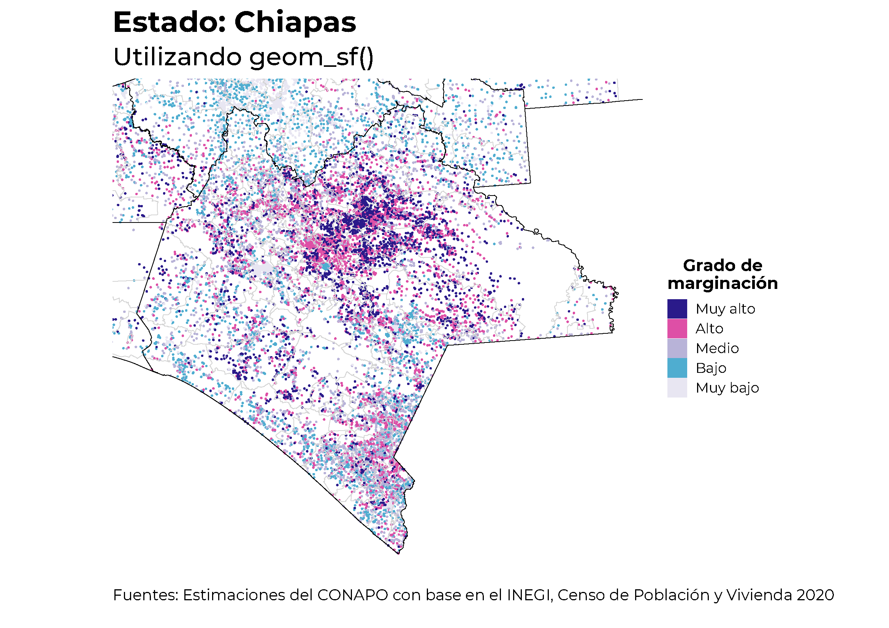{width="90%" fig-align="center"} 

#### Mapa con filtro  


```{r, class.source = "fold-hide"}
require(ggplot2)
require(tibble)
require(sf)

# Paleta  
paleta <- rev(colorRampPalette(pals::brewer.seqseq1(9))(5))

p <- list()
#for(i in 1:32){
for(i in 7){
  limites <- capas_estados %>%
               filter(id == estados[i]) %>%
                 summarise(min.x = min(.$long),
                           max.x = max(.$long),
                           min.y = min(.$lat),
                           max.y = max(.$lat))

p[[i]] <-  ggplot() + 
            geom_sf(data = tbl_localidad %>% filter(CVE_ENT == estados[i]),
                     mapping = aes(geometry = geometry, 
                                   fill = fct_relevel(GM_2020, "Muy alto","Alto","Medio","Bajo","Muy bajo"),
                                   color = fct_relevel(GM_2020, "Muy alto","Alto","Medio","Bajo","Muy bajo"))) + 
             geom_sf(data = tbl_localidad_p %>% filter(CVE_ENT == estados[i]),
                      mapping = aes(geometry = geometry, 
                                    fill = fct_relevel(GM_2020, "Muy alto","Alto","Medio","Bajo","Muy bajo"),
                                    color = fct_relevel(GM_2020, "Muy alto","Alto","Medio","Bajo","Muy bajo")),
                       size = 0.05) +
              geom_sf(data = tbl_municipios %>% filter(CVE_ENT == estados[i]),
                       mapping = aes(geometry = geometry), 
                        fill = 'transparent',
                         color = "#D4D4D4",
                          size = 0.3) + 
               geom_sf(data = tbl_estados %>% filter(CVE_ENT == estados[i]),
                        mapping = aes(geometry = geometry), 
                         fill = 'transparent',
                          color = "black") +
                coord_sf(xlim = c(limites$min.x,limites$max.x),
                         ylim = c(limites$min.y,limites$max.y)) +
                 theme_transparent() + 
                  theme(plot.title = element_text(size = 21, hjust = 0, family = "Montserrat", face = "bold"),
                        plot.subtitle = element_text(size = 18, hjust = 0, family = "Montserrat Medium"),
                        plot.caption = element_text(size = 11, hjust = 0.2, vjust = 1, family = "Montserrat"), 
                        axis.text = element_blank(),
                        axis.title = element_blank(),
                        axis.ticks = element_blank(),
                        legend.key.size = unit(0.5, "cm"),
                        legend.text = element_text(size = 10, family = "Montserrat"), 
                        legend.title = element_text(size = 12, hjust = 0.5, family = "Montserrat", face = "bold"),
                        legend.position = "right") + 
                   scale_fill_manual(values = paleta) + 
                    scale_color_manual(values = paleta) + 
                 labs(title = paste("Estado:", paste(nom_ent[i])),
                      subtitle = "Utilizando geom_sf()",
                      fill = stringr::str_wrap("Grado de marginación", 10),
                      color = stringr::str_wrap("Grado de marginación", 10),
                      caption = expression(paste("Fuentes: Estimaciones del CONAPO con base en el INEGI, Censo de Población y Vivienda 2020")))
}

#path = "Images/IML_2020_geom_sf.pdf"
#ggexport (list = p, width = 8, height = 5, res = 400, filename = path)

p[[7]]
```

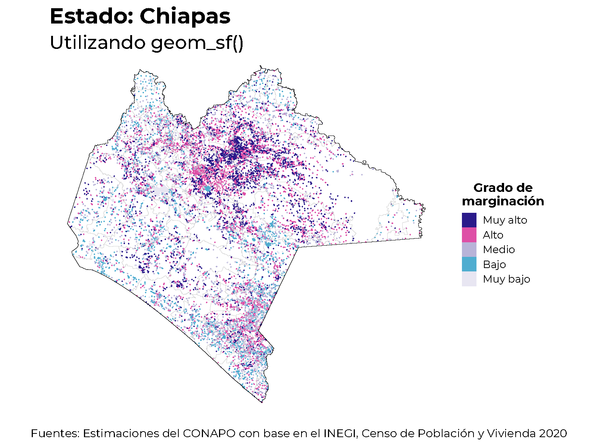{width="90%" fig-align="center"} 

## AGEB {.tabset .tabset-fade .tabset-pills}  

### `geom_map`

La función `ggmap()` devuelve un objeto `ggplot`. Puede usar este objeto `ggplot` resultante como lo haría con cualquier otro objeto ggplot (ejemplo, agregar geoms, cambiar tema). [GitHub: fresques/ggmap](https://github.com/fresques/ggmap)

Una de las bondades del paquete `ggmap`, permite hacer mediante el uso de herramientas de *Google Maps* directamente desde `R`. Este paquete permite extraer un mapa base de *Google Maps* y algunos otros servidores de mapas, para que luego se puedan trazar y agregar puntos, polígonos, líneas y otros elementos usando funciones `ggplot2`. Este paquete usa la `API` de *Google Maps*. Otras funciones en el paquete `ggmap`, necesita una clave `API` de Google Maps para que funcione.

```{r, class.source = "fold-hide"}
p <- IMU_2020 %>% 
      mutate(GM_2020 = fct_relevel(.$GM_2020,"Muy alto", "Alto", "Medio", "Bajo", "Muy bajo")) %>%
       ggplot() + 
        geom_map(map = capas_ageb, 
                  aes(map_id = CVE_GEO,
                      fill = GM_2020,
                      color = GM_2020), 
                   size = 1)  +
         geom_polygon(capas_estados,
                       mapping = aes(x = long, 
                                     y = lat, 
                                     group = group),
                       color = "dark grey",
                       fill = "transparent",
                       size = 0.6) +
           expand_limits(x = capas_localidad$long, y = capas_localidad$lat) + 
            theme_transparent() + 
             theme(plot.title = element_text(size = 21, hjust = 0.15, family = "Montserrat", face = "bold"),
                   plot.subtitle = element_text(size = 18, hjust = 0, family = "Montserrat Medium"),
                   plot.caption = element_text(size = 11, hjust = 0.2, vjust = 1, family = "Montserrat"), 
                   axis.text = element_blank(),
                   axis.title = element_blank(),
                   axis.ticks = element_blank(),
                   legend.key.size = unit(0.5, "cm"),
                   legend.text = element_text(size = 10, family = "Montserrat"), 
                   legend.title = element_text(size = 12, hjust = 0.5, family = "Montserrat", face = "bold"),
                   legend.position = c(0.8, 0.7)) + 
              scale_fill_viridis_d(option = "A", begin = 0.3, end = 0.8) + 
               scale_color_viridis_d(option = "A", begin = 0.3, end = 0.8) + 
                guides(color = 'none') +
          labs(title = "Índice de marginación a nivel AGEB, 2020",
                subtitle = "Utilizando ggmap()",
                 fill = stringr::str_wrap("Grado de marginación", 10),
                  caption = expression(paste("Fuentes: Estimaciones del CONAPO con base en el INEGI, Censo de Población y Vivienda 2020")))

#path = "Images/IMU_2020_gmap.pdf"
#ggexport(p, width = 8, height = 5, res = 400, filename = path)

p
```

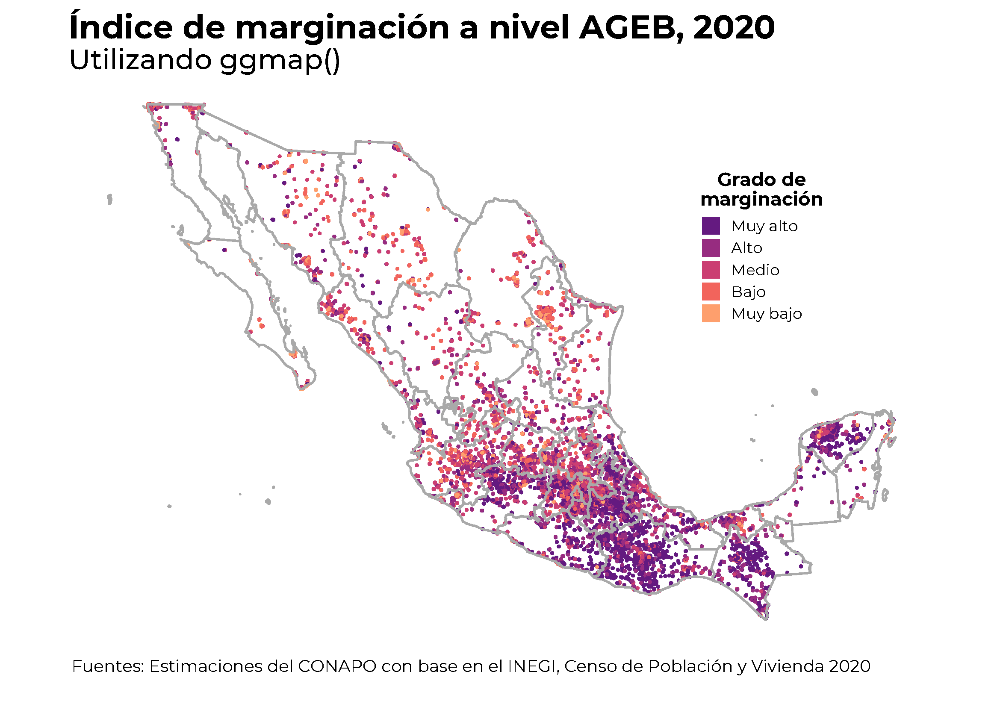{width="90%" fig-align="center"} 

### `geom_polygon`

La función `geom_polygon()` de la paquetería `ggplot2`, devuelve un objeto `ggplot` en el cual dibuja líneas entre puntos y los cierra ( es decir, dibuja una línea desde el último punto hasta el primer punto). En el cual es importante tener en cuenta que el data.frame incluye columnas con la ubicación de las áreas geográficas y se agregan como argumentos en la función `aes(x = long,  y = lat)`. También se incluye una columna que describe el orden en que se deben conectar estos puntos para formar un polígono (`order`), el nombre de la ageb (`id`) y una columna de grupo que separa los puntos en polígonos únicos que se deben trazar `aes (group = group)`.

```{r, class.source = "fold-hide"}
p <- ggplot() + 
      geom_polygon(capas_estados,
                    mapping = aes(x = long, 
                                  y = lat, 
                                  group = group), 
                     fill = 'transparent',
                      color="black", 
                       size = .15,
                        alpha = 0.9) +
       geom_polygon(capas_ageb,
                     mapping = aes(x = long, 
                                   y = lat, 
                                   group = group, 
                                   fill = fct_relevel(GM_2020, "Muy alto", "Alto", "Medio", "Bajo", "Muy bajo"), 
                                   color = fct_relevel(GM_2020, "Muy alto", "Alto", "Medio", "Bajo", "Muy bajo")),
                      size = .15,
                       alpha = 0.9) +
        coord_equal()  +
         theme_transparent() + 
          theme(plot.title = element_text(size = 21, hjust = 0, family = "Montserrat", face = "bold"),
                plot.subtitle = element_text(size = 18, hjust = 0, family = "Montserrat Medium"),
                plot.caption = element_text(size = 11, hjust = 0.2, vjust = 1, family = "Montserrat"), 
                axis.text = element_blank(),
                axis.title = element_blank(),
                axis.ticks = element_blank(),
                legend.key.size = unit(0.5, "cm"),
                legend.text = element_text(size = 10, family = "Montserrat"), 
                legend.title = element_text(size = 12, hjust = 0.5, family = "Montserrat", face = "bold"),
               legend.position = c(0.8, 0.7)) + 
           scale_fill_viridis_d(option = "A", begin = 0.3, end = 0.8) + 
            scale_color_viridis_d(option = "A", begin = 0.3, end = 0.8) +  
             guides(color = 'none', 
                    fill = guide_legend(override.aes = list(alpha = 1))) +
              labs(title = "Índice de marginación a nivel AGEB, 2020",
                   subtitle = "Utilizando geom_polygon()",
                   fill = stringr::str_wrap("Grado de marginación", 10),
                   caption = expression(paste("Fuentes: Estimaciones del CONAPO con base en el INEGI, Censo de Población y Vivienda 2020")))


#path = "Images/IMU_2020_geom_polygon.pdf"
#ggexport (p, width = 8, height = 5, res = 400, filename = path)

p
```

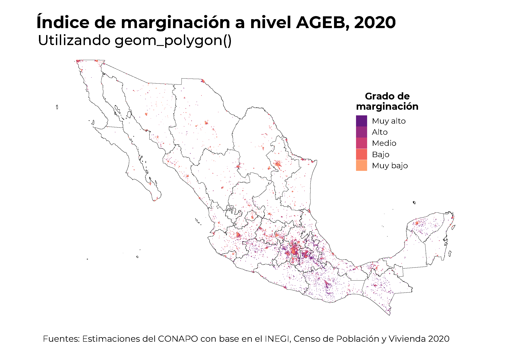{width="90%" fig-align="center"} 

#### Zona Metropolitana del Valle de México (ZMVM)

```{r, class.source = "fold-hide"}
tabla <- ZM_2020 %>%
          filter(CVE_ZM == "09.01")

p <-  ggplot() + 
       geom_polygon(capas_estados %>% filter(id %in% c("09", "13", "15")),
                     mapping = aes(x = long, 
                                   y = lat, 
                                   group = group), 
                      fill = 'transparent',
                       color = "black", 
                        size = 1,
                         linewidth = 1.2,
                          alpha = 0.9) +
       geom_polygon(capas_municipios %>% filter(CVE_ENT %in% c("09", "13", "15")),
                     mapping = aes(x = long, 
                                   y = lat, 
                                   group = group), 
                      fill = 'transparent',
                       color = "#C7C7C7", 
                        size = .1,
                         alpha = 0.7) +
       geom_polygon(capas_zm %>% filter(CVE_ZM %in% "09.01"),
                     mapping = aes(x = long, 
                                   y = lat, 
                                   group = group, 
                                   fill = fct_relevel(GM_2020, "Muy alto", "Alto", "Medio", "Bajo", "Muy bajo"),
                                   color = fct_relevel(GM_2020, "Muy alto", "Alto", "Medio", "Bajo", "Muy bajo")),
                      size = .15,
                       alpha = 0.7) +
        coord_equal() +
         theme_transparent() + 
          theme(plot.title = element_text(size = 21, hjust = 0, family = "Montserrat", face = "bold"),
                plot.subtitle = element_text(size = 18, hjust = 0, family = "Montserrat Medium"),
                plot.caption = element_text(size = 11, hjust = 0.2, vjust = 1, family = "Montserrat"), 
                axis.text = element_blank(),
                axis.title = element_blank(),
                axis.ticks = element_blank(),
                legend.key.size = unit(0.5, "cm"),
                legend.text = element_text(size = 10, family = "Montserrat"), 
                legend.title = element_text(size = 12, hjust = 0.5, family = "Montserrat", face = "bold"),
               legend.position = "right") + 
           scale_fill_viridis_d(option = "A", begin = 0.3, end = 0.8) + 
            scale_color_viridis_d(option = "A", begin = 0.3, end = 0.8) +  
             guides(color = 'none', 
                    fill = guide_legend(override.aes = list(alpha = 1))) +
              guides(color = 'none', 
                      fill = guide_legend(override.aes = list(alpha = 1))) +
       labs(title = "ZMVM: Índice de marginación a nivel AGEB, 2020",
             subtitle = "Utilizando geom_polygon()",
              fill = stringr::str_wrap("Grado de marginación", 10),
               caption = expression(paste("Fuentes: Estimaciones del CONAPO con base en el INEGI, Censo de Población y Vivienda 2020")))

#path = "Images/IMU_2020_ZMVM_geom_polygon.pdf"
#ggexport (p, width = 8, height = 5, res = 400, filename = path)

p
```

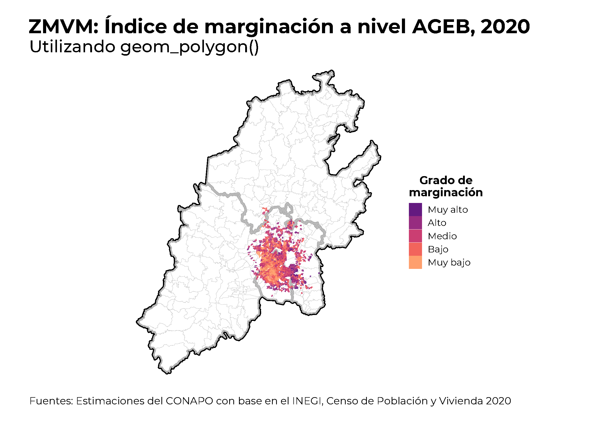{width="90%" fig-align="center"} 

### `geom_sf`

A continuación, se muestra un ejemplo de cómo visualizar objetos `sf`. Este tipo de función es un poco más amigable de usar.

La función `as_tibble` de la paquetería `tibble`, genera una base de datos genérica de S3 con métodos más eficientes para matrices y data.frame. Su envoltorio delgado permite trabajar de manera más rápida que un `data.frame`.

```{r, class.source = "fold-hide"}
# Paquetes
require(ggplot2)
require(tibble)
require(sf)

# Paleta  
paleta <- rev(colorRampPalette(pals::brewer.seqseq1(20))(5))

# Entidades Federativas
estados <- unique(IME_2020$CVE_ENT)
nom_ent <- unique(IME_2020$NOM_ENT)

q <- NULL
p <- list()
#for(i in 1:32){
for(i in 6){
  limites <- capas_estados %>%
               filter(id == estados[i]) %>%
                 summarise(min.x = min(.$long),
                           max.x = max(.$long),
                           min.y = min(.$lat),
                           max.y = max(.$lat))
q[[i]] <-  ggplot() + 
            geom_sf(data = tbl_ageb %>% filter(CVE_ENT == estados[i]),
                     mapping = aes(geometry = geometry, 
                                   fill = fct_relevel(GM_2020, "Muy alto","Alto","Medio","Bajo","Muy bajo"),
                                   color = fct_relevel(GM_2020, "Muy alto","Alto","Medio","Bajo","Muy bajo"),
                                   linetype = "Line1"),
                      size = 0.7) +
            geom_sf(data = tbl_localidad %>% filter(CVE_ENT == estados[i]),
                     mapping = aes(geometry = geometry, linetype = "Line2"), 
                     fill = 'transparent',
                     color = "#C70E8E", 
                      size = 0.03) + 
            geom_sf(data = tbl_localidad_p %>% filter(CVE_ENT == estados[i]),
                     mapping = aes(geometry = geometry, linetype = "Line2"), 
                      fill = 'transparent',
                       color = "#C70E8E", 
                        size = 0.03) + 
            geom_sf(data = tbl_municipios %>% filter(CVE_ENT == estados[i]),
                     mapping = aes(geometry = geometry), 
                     fill = 'transparent',
                     color = "#D4D4D4",
                     size = 0.3) + 
            geom_sf(data = tbl_estados %>% filter(CVE_ENT == estados[i]),
                     mapping = aes(geometry = geometry), 
                      fill = 'transparent',
                       color = "black") +
             coord_sf(xlim = c(limites$min.x,limites$max.x),
                      ylim = c(limites$min.y,limites$max.y)) +
              theme_transparent() + 
               theme(plot.title = element_text(size = 21, hjust = 0, family = "Montserrat", face = "bold"),
                     plot.subtitle = element_text(size = 18, hjust = 0, family = "Montserrat Medium"),
                     plot.caption = element_text(size = 11, hjust = 0.2, vjust = 1, family = "Montserrat"), 
                     axis.text = element_blank(),
                     axis.title = element_blank(),
                     axis.ticks = element_blank(),
                     legend.key.size = unit(0.5, "cm"),
                     legend.text = element_text(size = 10, family = "Montserrat"), 
                     legend.title = element_text(size = 12, hjust = 0.5, family = "Montserrat", face = "bold"),
                     legend.position = "right") + 
                 scale_fill_manual(values = paleta) + 
                  scale_color_manual(values = paleta) +  
                   scale_linetype_manual("Nivel", labels = c("AGEB", "Localidad"), values = c("Line1" = "solid", "Line2" = "solid")) +
                    guides(linetype = guide_legend(override.aes = list(linetype = "solid", 
                                                                       fill = 'transparent', 
                                                                       color = c("#771434", "#C70E8E"), 
                                                                       size = c(0.7, 0.03)))) +
             labs(title = paste("Estados:", nom_ent[i]),
                  subtitle = "Utilizando geom_sf()",
                   fill = stringr::str_wrap("Grado de marginación", 10),
                    color = stringr::str_wrap("Grado de marginación", 10),
                    caption = expression(paste("Fuentes: Estimaciones del CONAPO con base en el INEGI, Censo de Población y Vivienda 2020")))
if(i == 6){
  p[[i]] <- q[[i]] + 
             coord_sf(xlim = c(limites$min.x + 1060000,limites$max.x),
                      ylim = c(limites$min.y,limites$max.y)) 
} else {
  p[[i]] <- q[[i]]
}
}

#path = "Images/IMU_2020_geom_sf.pdf"
#ggexport (list = p, width = 8, height = 5, res = 400, filename = path)

p[[6]]
```


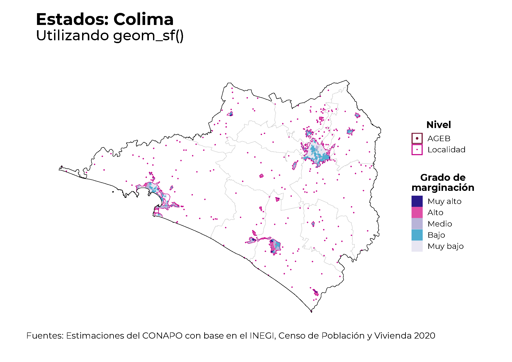{width="70%" fig-align="center"}  

# Complementos {.top2-tiles .tile2-text .tabset  .tabset-pills}

## Entidad{.tabset .tabset-fade .tabset-pills} 

###  Etiquetas   

Se utiliza la función `coordinates()` del paquete `sp` que permite localizar los centroides de cada estado. Permitiendo de esta manera encontrar la localización para las etiquetas de cada área geográfica y utilizando la función `geom_label_repel()` mediante los atributos `mapping = aes(x = Longitude, y = Latitude)` y de esta manera no permitir que las etiquetas del mapa se sobrelapen entre sí y se alejen de los puntos de datos generados por la función `coordinates()`.          
   
```{r, class.source = "fold-hide"}
#Paquete
require(ggrepel)
#https://github.com/EmilHvitfeldt/paletteer
#devtools::install_github("BlakeRMills/MoMAColors")
require(MoMAColors)

# "coordinates()" extrae los centroides de los polígonos, en el orden indicado en shape@data
centroids.df <- as.data.frame(coordinates(shape_estados)) %>%
                  rename("Longitude" = "V1","Latitude" = "V2")

p <- IME_2020 %>% 
      cbind(., centroids.df) %>%
       ggplot() + 
        geom_polygon(data = capas_estados,
                      mapping = aes(x = long, 
                                    y = lat, 
                                    group = group,
                                    fill = fct_relevel(GM_2020, "Muy alto", "Alto", "Medio", "Bajo", "Muy bajo")),
                       color = "dark grey",
                        size = 0.5) +
         geom_label_repel(aes(label = stringr::str_wrap(NOM_ENT, 15),
                               x = Longitude,
                                y = Latitude),
                           color = "#06156e",
                            force = 0.6,
                             box.padding = 0.25,
                              min.segment.length = 0.5,
                               size = 3.5, 
                                fill = "transparent",
                                 point.padding = 0.5,
                                  segment.size = 0.7,
                                   segment.colour = "dark grey",
                                    label.size = 0,
                                     alpha = 0.8) +
           expand_limits(x = capas_estados$long,  
                         y = capas_estados$lat) + 
            theme_transparent() + 
             theme(plot.title = element_text(size = 21, hjust = 0, family = "Montserrat", face = "bold"),
                   plot.subtitle = element_text(size = 18, hjust = 0, family = "Montserrat Medium"),
                   plot.caption = element_text(size = 11, hjust = 0.2, vjust = 1, family = "Montserrat"), 
                   axis.text = element_blank(),
                   axis.title = element_blank(),
                   axis.ticks = element_blank(),
                   legend.key.size = unit(0.5, "cm"),
                   legend.text = element_text(size = 10, family = "Montserrat"), 
                   legend.title = element_text(size = 12, hjust = 0.5, family = "Montserrat", face = "bold"),
                   legend.position = c(0.9, 0.7)) + 
              scale_fill_moma_d("Ernst", direction = -1) +
               scale_color_moma_d("Ernst", direction = -1) +
                guides(fill = guide_legend(override.aes = list(color = paleta)),
                       color = 'none') +
         labs(title = "Índice de marginación a nivel estatal, 2020",
               fill = stringr::str_wrap("Grado de marginación", 10),
                caption = expression(paste("Fuentes: Estimaciones del CONAPO con base en el INEGI, Censo de Población y Vivienda 2020")))

#path = "Images/IME_2020_geom_polygon_etiquetas.pdf"
#ggexport (p, width = 8, height = 5, res = 400, filename = path)

p
```
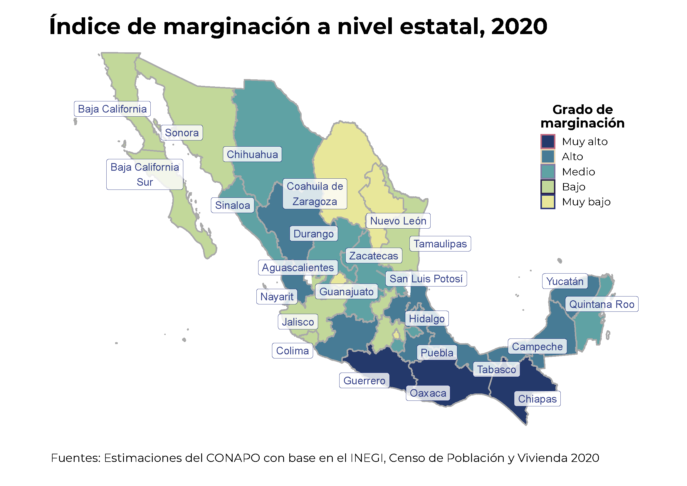{width="70%" fig-align="center"} 

### `Annotation_scale`  

Usando las funciones `annotation_scale()` y `annotation_north_arrow()` del paquete `ggspatial` se puede agregar una barra de escala o bien una flecha de norte. El sistema de posicionamiento de estas características está controlado por el argumento de ubicación (ejemplo, location = "tl" ~ topleft). Usando los argumentos `pad_x` y `pad_y` se pueden hacer ajustes menores al posicionamiento de los iconos.     

```{r, class.source = "fold-hide"}
#Paquetes
require(ggspatial)

#Ejemplos
#style = north_arrow_orienteering
#style = north_arrow_fancy_orienteering
#style = north_arrow_minimal
#style = north_arrow_nautical

p <- IME_2020 %>% 
      ggplot() + 
       geom_polygon(data = capas_estados,
                     mapping = aes(x = long, 
                                   y = lat, 
                                   group = group,
                                   fill = fct_relevel(GM_2020, "Muy alto", "Alto", "Medio", "Bajo", "Muy bajo")),
                      color = "dark grey",
                       size = 0.5) +
        annotation_north_arrow(location = "tl", 
                               style = north_arrow_fancy_orienteering, 
                               pad_x = unit(0, "cm"), 
                               height = unit(1, "cm"),
                               width = unit(1, "cm")) +
        annotation_scale(location = "bl", 
                         plot_unit = "m" , 
                         pad_y = unit(0, "cm"), 
                         text_family = "Montserrat") +
         expand_limits(x = capas_estados$long,  
                       y = capas_estados$lat) + 
          theme_transparent() + 
           theme(plot.title = element_text(size = 21, hjust = 0, family = "Montserrat", face = "bold"),
                 plot.subtitle = element_text(size = 18, hjust = 0, family = "Montserrat Medium"),
                 plot.caption = element_text(size = 11, hjust = 0.2, vjust = 1, family = "Montserrat"), 
                 axis.text = element_blank(),
                 axis.title = element_blank(),
                 axis.ticks = element_blank(),
                 legend.key.size = unit(0.5, "cm"),
                 legend.text = element_text(size = 10, family = "Montserrat"), 
                 legend.title = element_text(size = 12, hjust = 0.5, family = "Montserrat", face = "bold"),
                 legend.position = c(0.9, 0.7)) + 
            scale_fill_moma_d("Kippenberger", direction = -1) +
             scale_color_moma_d("Kippenberger", direction = -1) + 
                labs(title = "Índice de marginación a nivel estatal, 2020",
                     fill = stringr::str_wrap("Grado de marginación", 10),
                     caption = expression(paste("Fuentes: Estimaciones del CONAPO con base en el INEGI, Censo de Población y Vivienda 2020")))

#path = "Images/IME_2020_annotation.pdf"
#ggexport (p, width = 8, height = 5, res = 400, filename = path)

p
```

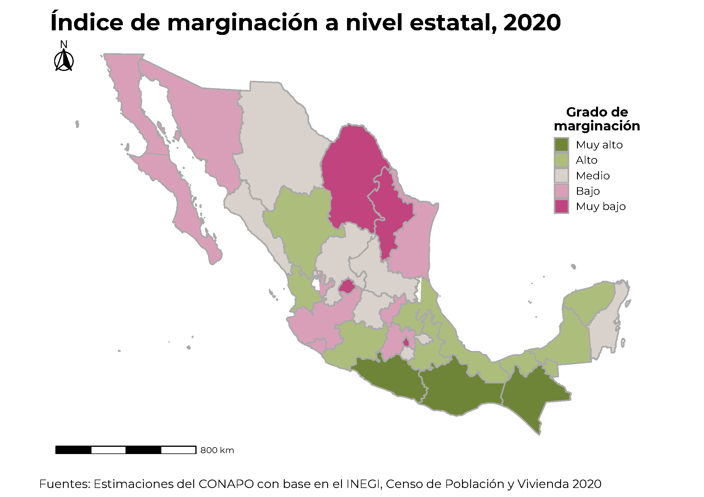{width="70%" fig-align="center"} 

## Municipios{.tabset .tabset-fade .tabset-pills} 

### Etiquetas   

Se utiliza la función `coordinates()` del paquete `sp` que permite localizar los centroides de cada muncipio. Permitiendo de esta manera encontrar la localización para las etiquetas de cada área geográfica y utilizando la función `geom_label_repel()` mediante los atributos `mapping = aes(x = Longitude, y = Latitude)` y de esta manera no permitir que las etiquetas del mapa se sobrelapen entre sí y se alejen de los puntos de datos generados por la función `coordinates()`.   


#### Zona Metropolitana del Valle de México (`ZMVM`)


```{r, class.source = "fold-hide"}
capas_zm <- left_join(capas_municipios, 
                       ZM_2020 %>% dplyr::select(-NOM_ENT, -NOM_MUN, -CVE_ENT), 
                        by = c("id" = "CVE_MUN")) %>%
             filter(CVE_ZM %in% "09.01") 
              
# Paleta  
paleta <- rev(colorRampPalette(pals::brewer.seqseq1(20))(5))

# "coordinates()" extrae los centroides de los polígonos, en el orden indicado en shape@data
centroids.df <- as.data.frame(coordinates(shape_estados)) %>%
                  rename("Longitude" = "V1","Latitude" = "V2")

tabla <- ZM_2020 %>%
          filter(CVE_ZM == "09.01") %>%
           dplyr::select(CVE_MUN) %>%
            unique() %>% 
             as.vector()

p <- ggplot() + 
      geom_polygon(data = capas_zm,
                    mapping = aes(x = long, 
                                  y = lat, 
                                  group = group,
                                  fill = fct_relevel(GM_2020, c("Muy alto","Alto","Medio","Bajo","Muy bajo")),
                                  color = fct_relevel(GM_2020, c("Muy alto","Alto","Medio","Bajo","Muy bajo"))),
                     size = 0.3) +
       geom_polygon(capas_municipios %>% filter(CVE_ENT %in% c("09", "13", "15")),
                     mapping = aes(x = long, 
                                   y = lat, 
                                   group = group), 
                      fill = NA,
                       color = "#C7C7C7", 
                        size = .1,
                         alpha = 0.7) + 
        geom_polygon(capas_estados %>% filter(id %in% c("09", "13", "15")),
                      mapping = aes(x = long, 
                                    y = lat, 
                                    group = group), 
                       fill = NA,
                        color = "black", 
                         size = 1,
                          linewidth = 1.2,
                           alpha = 0.9) +
         geom_label_repel(data = data.frame(IME_2020, centroids.df) %>%
                                  filter(CVE_ENT %in% c("09","13","15")),
                           mapping = aes(label = stringr::str_wrap(NOM_ENT, 15),
                                         x = Longitude,
                                         y = Latitude), 
                            box.padding = 0.25,
                             point.padding = 3,
                              size = 5, 
                               fill = "#EDEDED",
                                color = "#000036",
                                 segment.colour= "dark grey",
                                  alpha = 0.8) +
           coord_equal() + 
            theme_transparent() + 
             theme(plot.title = element_text(size = 21, hjust = 0, family = "Montserrat", face = "bold"),
                   plot.subtitle = element_text(size = 18, hjust = 0, family = "Montserrat Medium"),
                   plot.caption = element_text(size = 11, hjust = 0.2, vjust = 1, family = "Montserrat"), 
                   axis.text = element_blank(),
                   axis.title = element_blank(),
                   axis.ticks = element_blank(),
                   legend.key.size = unit(0.5, "cm"),
                   legend.text = element_text(size = 10, family = "Montserrat"), 
                   legend.title = element_text(size = 12, hjust = 0.5, family = "Montserrat", face = "bold"),
                   legend.position = "right") + 
               scale_fill_manual(values = paleta) + 
                scale_color_manual(values = paleta) + 
                guides(color = 'none') +
         labs(title = "ZMVM: Zona Metropolitana del Valle de México, 2020",
               fill = stringr::str_wrap("Grado de marginación", 10),
                caption = expression(paste("Fuentes: Estimaciones del CONAPO con base en el INEGI, Censo de Población y Vivienda 2020")))
 
#path = "Images/IMM_2020_geom_polygon_etiquetas.pdf"
#ggexport (p, width = 6, height = 5, res = 400, filename = path)

p
```

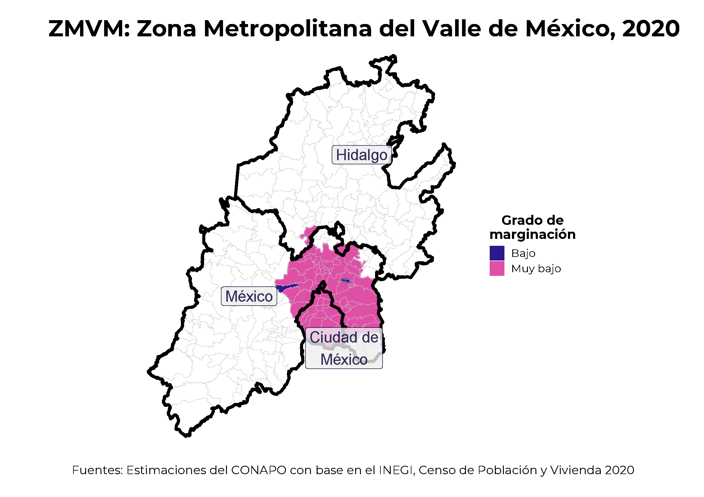{width="90%" fig-align="center"} 


#### Por estados


```{r, class.source = "fold-hide"}
# "coordinates()" extrae los centroides de los polígonos, en el orden indicado en shape@data
centroids.df <- as.data.frame(coordinates(shape_municipios)) %>%
                 rename("Longitude" = "V1","Latitude" = "V2") %>%
                  mutate(CVE_ENT = shape_municipios@data$CVE_ENT,
                         CVE_MUN = shape_municipios@data$CVE_GEO,
                         NOM_MUN = shape_municipios@data$NOMGEO
                         #NOM_MUN = iconv(shape_municipios@data$NOMGEO, from = "utf8", to = "latin9")
                         )
p <- NULL
#for(i in 1:32){
for(i in 7){
# Se generan los límites de cada estados, en caso de que se requiera modificar alguno
limites <- capas_municipios %>%
            subset(CVE_ENT == estados[i]) %>%
             summarise(min.x = min(.$long),
                       max.x = max(.$long),
                       min.y = min(.$lat),
                       max.y = max(.$lat))

# Se genera una muestra aleatoria   
sample <- centroids.df %>%
            filter(CVE_ENT == estados[i]) %>%
             sample_n(., min(30, nrow(.)))

q <- ggplot() + 
      geom_polygon(data = capas_municipios %>% filter(CVE_ENT == estados[i]),
                    mapping = aes(x = long, 
                                  y = lat, 
                                  group = group,
                                  fill = fct_relevel(GM_2020, c("Muy alto", "Alto", "Medio", "Bajo", "Muy bajo"))),
                     color = "dark grey",
                      size = 0.3) +
       geom_polygon(data = capas_estados %>% filter(id == estados[i]),
                     mapping = aes(x = long, 
                                   y = lat, 
                                   group = group),
                      fill = 'transparent',
                       color = "black",
                        size = 0.8) +
        geom_label_repel(data = sample,
                          mapping = aes(label = stringr::str_wrap(NOM_MUN, 15),
                                        x = Longitude,
                                        y = Latitude), 
                           size = 3.5, 
                            fill = "#EDEDED",
                             color = "#000036",
                              alpha = 0.8,
                               force = 0.2,
                                force_pull = 0.5,
                                 direction = c("both"),
                                  box.padding = 0.25,
                                   point.padding = 0,
                                    segment.colour= "dark grey",
                                     segment.size = 1,
                                      min.segment.length = 0.5) +
           coord_equal() + 
            theme_transparent() + 
             theme(plot.title = element_text(size = 21, hjust = 0, family = "Montserrat", face = "bold"),
                   plot.subtitle = element_text(size = 18, hjust = 0, family = "Montserrat Medium"),
                   plot.caption = element_text(size = 11, hjust = 0.2, vjust = 1, family = "Montserrat"), 
                   axis.text = element_blank(),
                   axis.title = element_blank(),
                   axis.ticks = element_blank(),
                   legend.key.size = unit(0.5, "cm"),
                   legend.text = element_text(size = 10, family = "Montserrat"), 
                   legend.title = element_text(size = 12, hjust = 0.5, family = "Montserrat", face = "bold"),
                   legend.position = "right") + 
             scale_fill_manual(values = brewer.pal(n = 9, name = "Spectral"),
                               na.translate = T) + 
              guides(color = 'none') +
        labs(title = paste("Estado:", nom_ent [i]),
              fill = stringr::str_wrap("Grado de marginación", 10),
               caption = expression(paste("Fuentes: Estimaciones del CONAPO con base en el INEGI, Censo de Población y Vivienda 2020")))

if(i %in% c(1:5, 7:32)){
  p[[i]] <- q  
} else {
  p[[i]] <- q + coord_cartesian(xlim = c(limites$min.x + 1060000, limites$max.x),
                                ylim = c(limites$min.y, limites$max.y)) 
  }
}

#path = "Images/IMM_2020_etiquetas por estado.pdf"
#ggexport (list = p, width = 8, height = 5, res = 400, filename = path)

p[[7]]
```

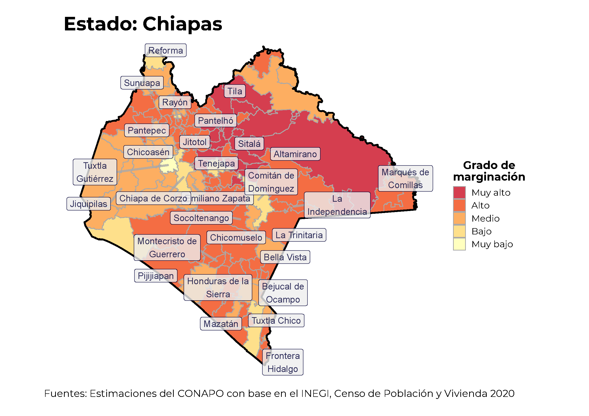{width="90%" fig-align="center"} 

### 2010 - 2020      

Son nueve indicadores simples, los que conforman el índice de marginación a nivel municipal. De los cuales se enfocan en cuatro dimensiones de exclusión social.  

```{r,class.source = "fold-show"}
Indicadores <- c('Porcentaje de población de 15 años o más analfabeta', 
                 'Porcentaje de población de 15 años o más sin educación básica',
                 'Porcentaje de ocupantes en viviendas sin drenaje ni excusado',
                 'Porcentaje de ocupantes en viviendas sin energía eléctrica', 
                 'Porcentaje de ocupantes en viviendas sin agua entubada', 
                 'Porcentaje de ocupantes en viviendas con piso de tierra',
                 'Porcentaje de población en localidades con menos de 5 000 habitantes', 
                 'Porcentaje de viviendas con algún nivel de hacinamiento',
                 'Porcentaje de población ocupada con ingresos de hasta 2 salarios mínimos')
```

**Se cargan las bases de datos de los indicadores simples del índice de marginación 2010-2020**   

```{r, class.source = "fold-show"}
tablas <- c("2010", "2015", "2020")  

for(i in tablas){
  assign(paste0("Ind_", i), read_xlsx(paste0(here::here(), "/Data/Indicadores_", i, ".xlsx"), sheet = "Indicadores") %>% 
                              rename("ANIO" = "AÑO"))
}

### Se crea un data.frame (se incluyen todo los años)
Ind <- do.call(dplyr::bind_rows, list(Ind_2010, Ind_2015, Ind_2020))
```

Utilizando la función `cut()` y `quantile` se dividen en cuantiles cada una de las variables simples de todos los años y de esta manera poder visualizar la evolución de los indicadores de rezago.   

```{r, class.source = "fold-show"}
Ind <-  Ind %>%
         mutate_at(vars(7:15), 
                   .funs = funs(cut(., breaks = quantile(unique(.), probs = seq(0, 1, 0.2)), include.lowest = TRUE, dig.lab = 2)),
                    .names = "Q_{col}")
```


Para poder visualizar el mapa a nivel municipal dentro de conjunto de datos del Marco Geoestadístico Nacional [`MGN`], donde este conjunto abarca varias capas de datos vectoriales.   
Se toma como referencia el `Marco Geoestadístico, 2010 Versión 4.3`, `Marco Geoestadístico, junio 2016` y `Marco Geoestadístico, 2020`, que es producto de la actualización de censos, conteos, encuestas y registros administrativos.    

**Shape de municipios 2010**  

```{r,results=FALSE, class.source = "fold-show"}
shape_estados_2010 <- readOGR(dsn = paste0(here::here(), "/MGN 2010/32_Entidades_Federativas"),
                               layer = "ESTADOS",
                              )

shape_municipios_2010 <- readOGR(dsn = paste0(here::here(), "/MGN 2010/32_Entidades_Federativas"),
                                 layer = "MUNICIPIOS",
                                )

# Se crea un ID único o una Clave Geoestadística 
shape_municipios_2010@data <- shape_municipios_2010@data %>%
                                mutate(CVE_GEO = paste0(CVE_ENT, CVE_MUN))
```

**Shape municipio 2015**


```{r, results=FALSE, class.source = "fold-show"}
shape_estados_2015 <- readOGR(dsn = paste0(here::here(), "/MGN Junio 2016/conjunto_de_datos"),
                               layer = "areas_geoestadisticas_estatales"
                              )

shape_municipios_2015 <- readOGR(dsn = paste0(here::here(), "/MGN Junio 2016/conjunto_de_datos"),
                                  layer = "areas_geoestadisticas_municipales"
                                )

shape_municipios_2015@data <- shape_municipios_2015@data %>%
                                mutate(CVE_GEO = paste0(CVE_ENT, CVE_MUN))
```

Se elimina al municipio `23011` Puerto Morelos del estado de  Quintana Roo, debido a que no tiene calculado el `IM 2015`.  

```{r, class.source = "fold-show"}
require(spdplyr)
shape_municipios_2015 <- shape_municipios_2015 %>%
                           spdplyr:::filter.Spatial(CVE_GEO != 23011)
```

**Se unen las bases de los indicadores simples a los shapes**  

```{r, class.source = "fold-show"}
capas_estados_2010 <- fortify(shape_estados_2010, id = "CVE_ENT") 
capas_municipios_2010 <- dplyr::right_join(fortify(shape_municipios_2010, id = "CVE_GEO"), 
                                            Ind %>% dplyr::select(-CVE_ENT, -NOM_ENT, -NOM_MUN) %>%
                                             filter(ANIO == "2010") %>%
                                              arrange(.$CVE_MUN) %>%
                                               mutate(id = as.character(seq(0, to = (nrow(.) - 1)))),
                                                by =  c("id")) 
```

```{r,class.source = "fold-show"}
capas_estados_2015 <- fortify(shape_estados_2015, id = "CVE_ENT") 
capas_municipios_2015 <- dplyr::right_join(fortify(shape_municipios_2015, id = "CVE_GEO"), 
                                            Ind %>% dplyr::select(-CVE_ENT, -NOM_ENT, -NOM_MUN) %>%
                                             filter(ANIO == "2015") %>%
                                              arrange(.$CVE_MUN) %>%
                                               mutate(id = as.character(seq(0, to = (nrow(.) - 1)))),
                                                by =  c("id")) 
```

```{r,class.source = "fold-show"}
capas_estados_2020 <- fortify(shape_estados, id = "CVE_ENT") 
tabla <- fortify(shape_municipios, id = "CVE_GEO")
capas_municipios_2020 <- dplyr::right_join(fortify(shape_municipios, id = "CVE_GEO"), 
                                            Ind %>% dplyr::select(-CVE_ENT, -NOM_ENT, -NOM_MUN) %>%
                                                     filter(ANIO == "2020") %>%
                                                      arrange(.$CVE_MUN) %>%
                                                       mutate(id = as.character(seq(0, to = (nrow(.) - 1)))),
                                                by =  c("id" = "CVE_MUN")) 
```

**Utilizando dos capas**

En este tipo de gráficos se utiliza la **capa de municipios** y la **capa de estados**. Para cada caso se usa la función `geom_polygon()` del paquete `ggplot2::` y así poder encontrar las delimitaciones de los municipios en su respectiva entidad.    

```{r indicadores_simples, class.source = "fold-hide"}
Variables <- colnames(capas_municipios_2010)

p <- NULL
for(i in tablas){
#p[[i]] <- lapply(c(11:19), function(x){ 
p[[i]] <- lapply(c(11), function(x){ 
            ggplot() + 
              geom_polygon(get(paste0("capas_municipios_", i)) ,
                            mapping=aes(x = long, y = lat, group = group, fill = get(Variables[x])),
                             color = "transparent", 
                              size = 0.5,
                               alpha = 0.9) +
               geom_polygon(get(paste0("capas_estados_", i)),
                             mapping = aes(x = long, y = lat, group = group),
                              color = "dark grey",
                               fill = "transparent",
                                size = 0.5) +
                  expand_limits(x = get(paste0("capas_estados_", i))$long, 
                                  y = get(paste0("capas_estados_", i))$lat) + 
                    coord_equal() +
                     theme_void() + 
                      theme(plot.title = element_text(size = 15, family = "Montserrat"),
                            plot.subtitle = element_text(size = 15, hjust = 0.08 , family = "Montserrat"),
                            plot.margin = margin(1, 1, 1, 1, "cm"),
                            plot.caption = element_text(size = 10, hjust = 0.1, vjust = -1.5, family = "Montserrat"), 
                            axis.title.x = element_text(size = 8, family = "Montserrat"),
                            axis.text.x = element_blank(),
                            axis.text.y = element_blank(), 
                            legend.text = element_text(size = 10, family = "Montserrat"),
                            legend.key.size = unit(0.6, "cm"),
                            legend.position = c(0.8, 0.7)) + 
                       scale_fill_manual(values = usecol(pal_petrol, n = 5)) +
                        guides(color = FALSE) +
                      labs(subtitle = paste(i),
                            x = "",
                             y = "",
                              fill = paste(Variables[x-9]))
    }
  )   
}
p
```

**Mapas de los indicadores simples 2010-2020**    

```{r mindsimples,fig.width=10, fig.height=10, class.source = "fold-hide"}
# Titulo de los gráficos
#for(i in 1:9){
for(i in 1){
legend <- get_legend(p[["2010"]][[i]] + theme(legend.position = c(0.5, 0.5),
                                               legend.key.size = unit(0.8, "cm"),
                                                legend.title = element_blank()))

q <- ggarrange(p[["2010"]][[i]] + theme(plot.margin = margin(0.5, -1, -1, 0, "cm"),
                                         legend.position = 'none'), 
               p[["2015"]][[i]] + theme(plot.margin = margin(0.5, 0, -1, -1, "cm"),
                                        legend.position = 'none'), 
               p[["2020"]][[i]] + theme(plot.margin = margin(0, 0, 0, 0, "cm"),
                                        legend.position = 'none'), 
               legend, 
               ncol = 2, nrow = 2, widths = c(0.5, 0.5, 0.5, 0.3), heights = c(0.5, 0.5, 0.5, 0.3))
        
#path = paste0("Images/Mapa_", colnames(Ind)[6 + i], ".pdf")
#ggexport (annotate_figure(q, bottom =  text_grob(paste(stringr::str_wrap(Indicadores[i], 25, indent = 1, exdent = 1),"\n"),
 #                                                family = "Montserrat", 
  #                                               face = "plain", 
   #                                              size = 18
    #                                             #hjust = 0,
     #                                            #vjust = 0
      #                                           )),
       #   width = 10, height = 8, res = 400, filename = path)
}

img <- annotate_figure(q, bottom =  text_grob(paste(stringr::str_wrap(Indicadores[i], 25, indent = 1, exdent = 1),"\n"),
                                              family = "Montserrat", 
                                              face = "plain", 
                                              size = 20))
```

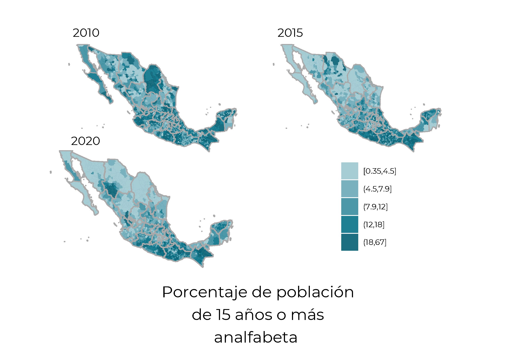{width="90%" fig-align="center"} 


```{r, echo = FALSE, eval = FALSE}
saveRDS(shape_estados, file = paste0(here::here(), "/Output/shape_estados.RDS"))
saveRDS(capas_estados, file = paste0(here::here(), "/Output/capas_estados.RDS"))
saveRDS(layer_estados, file = paste0(here::here(), "/Output/layer_estados.RDS"))
saveRDS(tbl_estados, file = paste0(here::here(), "/Output/tbl_estados.RDS"))
saveRDS(shape_municipios, file = paste0(here::here(), "/Output/shape_municipios.RDS"))
saveRDS(capas_municipio, file = paste0(here::here(), "/Output/capas_municipios.RDS"))
saveRDS(layer_municipios, file = paste0(here::here(), "/Output/layer_municipios.RDS"))
saveRDS(tbl_municipios, file = paste0(here::here(), "/Output/tbl_municipios.RDS"))
saveRDS(shape_localidad, file = paste0(here::here(), "/Output/shape_localidad.RDS"))
saveRDS(capas_localidad, file = paste0(here::here(), "/Output/capas_localidad.RDS"))
saveRDS(layer_localidad, file = paste0(here::here(), "/Output/layer_localidad.RDS"))
saveRDS(tbl_localidad, file = paste0(here::here(), "/Output/tbl_localidad.RDS"))
saveRDS(shape_localidad_p, file = paste0(here::here(), "/Output/shape_localidad_p.RDS"))
saveRDS(capas_localidad_p, file = paste0(here::here(), "/Output/capas_localidad_p.RDS"))
saveRDS(layer_localidad_p, file = paste0(here::here(), "/Output/layer_localidad_p.RDS"))
saveRDS(tbl_localidad_p, file = paste0(here::here(), "/Output/tbl_localidad_p.RDS"))
saveRDS(shape_ageb, file = paste0(here::here(), "/Output/shape_ageb.RDS"))
saveRDS(capas_ageb, file = paste0(here::here(), "/Output/capas_ageb.RDS"))
saveRDS(layer_ageb, file = paste0(here::here(), "/Output/layer_ageb.RDS"))
saveRDS(tbl_ageb, file = paste0(here::here(), "/Output/tbl_ageb.RDS"))
saveRDS(capas_zm, file = paste0(here::here(), "/Output/capas_zm.RDS"))
save(IME_2020, file = paste0(here::here(), "/Output/IME_2020.Rdata"))
save(IMM_2020, file = paste0(here::here(), "/Output/IMM_2020.Rdata"))
save(IML_2020, file = paste0(here::here(), "/Output/IML_2020.Rdata"))
save(IMU_2020, file = paste0(here::here(), "/Output/IMU_2020.Rdata"))
save(ZM_2020, file = paste0(here::here(), "/Output/ZM_2020.RData"))
```


# Referencias

Datos Abiertos de México - Índice de marginación (carencias poblacionales) por localidad, municipio y entidad. (2021). Retrieved February 13, 2022, from <https://datos.gob.mx/busca/dataset/indice-de-marginacion-carencias-poblacionales-por-localidad-municipio-y-entidad>

Wickham, H. (2022). A Grammar of Data Manipulation • dplyr. Retrieved February 12, 2022, from <https://dplyr.tidyverse.org/>

Garnett, R. (2018). cheatsheets/sf.pdf at main · rstudio/cheatsheets · GitHub. Retrieved February 12, 2022, from <https://github.com/rstudio/cheatsheets/blob/main/sf.pdf>

Lovelace, R., Nowosad, J., & Muenchow, J. (2019). Geocomputation with R. CRC Press. <https://geocompr.robinlovelace.net/>

# Librerías

**Librerías que se usaron en el trabajo**

```{r, echo = FALSE, eval = TRUE}
sesion_info <- devtools::session_info()
knitr::kable(dplyr::select(tibble::as_tibble(sesion_info$packages %>% dplyr::filter(attached == TRUE)),
                    c(package, loadedversion, source))) %>%
 kableExtra::kable_classic(full_width = TRUE, html_font = 'Montserrat Medium', font_size = 10) 
```


<a rel="license" href="http://creativecommons.org/licenses/by/4.0/"></a><br />This work by [**Diana Villasana Ocampo**]{xmlns:cc="http://creativecommons.org/ns#" property="cc:attributionName"} is licensed under a <a rel="license" href="http://creativecommons.org/licenses/by/4.0/">Creative Commons Attribution 4.0 International License</a>.  
