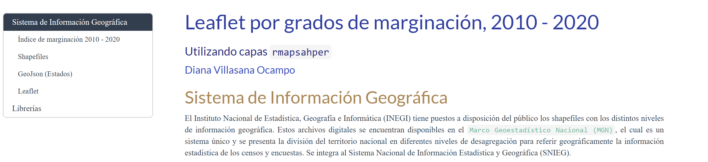
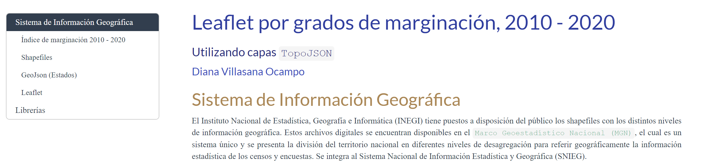
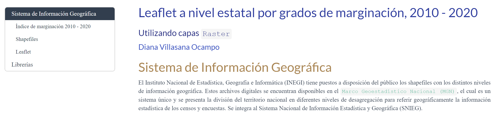
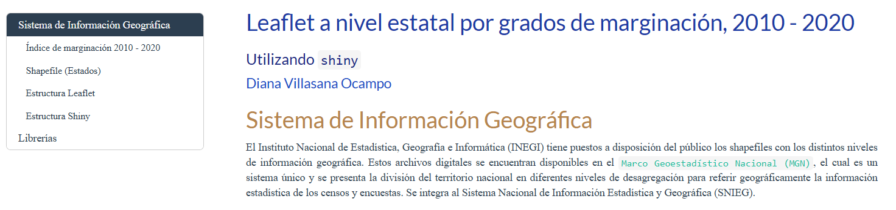

<!-- README.md is generated from README.Rmd. Please edit that file -->

<!-- badges: start -->

[](https://github.com/r-lib/usethis/actions/workflows/R-CMD-check.yaml)

<!-- badges: end -->

```{r, include = FALSE}
knitr::opts_chunk$set(
  collapse = TRUE,
  comment = "#>"
)
#usethis::use_readme_rmd()
```

# Mapas por desagregaciones geográficas de México 

## Anotaciones

<!-- Anotaciones: end -->

Este repositorio puede ir cambiando, ya que se encuentra en versión de
control y esta es la primera versión.

## Instalación previa

Es necesario contar con el paquete **rmarkdown** dentro de [RStudio
IDE](https://www.rstudio.com/products/rstudio/download), pero no
necesita instalarlo explícitamente o bien cargarlo, ya que RStudio hace
ambas cosas automáticamente cuando es necesario. También se requiere una
versión reciente de `r paste("Pandoc (>= ", rmarkdown::pandoc_version(), ")", sep = "")`; RStudio también incluye esto
automáticamente, por lo que no se necesita descargar Pandoc si planea
usar rmarkdown desde el IDE de RStudio.


``` r
install.packages("rmarkdown")
```

# Repositorio de Mapas en `R`

### Mapas por desagregaciones geográficas de México <a id = "Mapas_Mexico"></a> 

El primer documento se utilizan diferentes paqueterías en el entorno de R, la cual se toman los diferentes niveles de desagregación en México. Tomando como base a el índice de marginación 2020.  


| Niveles de desagregación   |
|:--------------------------:|
| Entidad Federativa         |
| Municipio                  |
| Localidad                  |
| AGEB                       |


**Enlace:** https://dvillasanao.github.io/Mapas_R/R/01_Mapas%20por%20desagregaciones%20geograficas%20de%20Mexico.nb.html 

<html>
<body>
  <a href = "https://dvillasanao.github.io/Mapas_R/R/01_Mapas%20por%20desagregaciones%20geograficas%20de%20Mexico.nb.html" target="_blank">

  </a>
</body>
</html>

### Contenido

- [Mapas por desagregaciones geográficas de México](#Mapas_Mexico)
- [Mapas en formato GeoJSON](#GeoJSON)
- [Mapas en formato RMapshaper](#RMapshaper)
- [Mapas en formato TopoJSON](#TopoJSON)
- [Mapas en formato Raster](#Raster)
- [Mapas con Shiny](#Shiny)


### Manejo de diferentes datos en formato `JSON`   

#### `GeoJSON`<a id = "GeoJSON"></a> 

Los archivos [GeoJSON](https://enterprise.arcgis.com/es/portal/latest/use/geojson.htm) son archivos de texto que almacenan datos geoespaciales en el formato de intercambio GeoJSON. Estos archivos se utilizan para representar entidades geográficas, como puntos, líneas y polígonos, junto con sus atributos no espaciales (metadatos). Cada entidad geográfica en un archivo GeoJSON se describe utilizando la sintaxis `JSON` (JavaScript Object Notation), donde se emplean el Sistema Geodésico Mundial de 1984 (WGS84) como su sistema de referencia de coordenadas y utiliza grados decimales como unidades.  


#### IMx2020 (Nivel entidad federativa, 2010 - 2020)   

**Enlace:** https://dvillasanao.github.io/Mapas_R/docs/01.01_Leaflet-por-a%C3%B1o-2010_2020--GeoJSON-.html 

<html>
<body>
  <a href="https://dvillasanao.github.io/Mapas_R/docs/01.01_Leaflet-por-a%C3%B1o-2010_2020--GeoJSON-.html" target="_blank">
    
  </a>
</body>
</html>
 
#### IMx2020 (Nivel entidad federativa desagregado por grado de marginación, 2010 - 2020)   

**Enlace:** https://dvillasanao.github.io/Mapas_R/docs/01.02_Leaflet-por-año-y-grado-de-marginacion--GeoJSON-.html

<html>
<body>
  <a href="https://dvillasanao.github.io/Mapas_R/docs/01.02_Leaflet-por-año-y-grado-de-marginacion--GeoJSON-.html" target="_blank">
    
  </a>
</body>
</html>

#### `RMapshaper` <a id = "RMapshaper"></a>  

`RMapshaper` es un paquete que proporciona una interfaz para la biblioteca JavaScript **mapshaper**, que se utiliza para simplificar, transformar y analizar datos geoespaciales. Este paquete es especialmente útil para trabajar con archivos GeoJSON, Shapefiles y otros formatos de datos espaciales, reduciendo el tamaño del archivo y la complejidad de las geometrías, lo que puede mejorar el rendimiento en aplicaciones web y análisis.   

#### IMx2020 (RMapshaper)    

**Enlace:** https://dvillasanao.github.io/Mapas_R/docs/01.03_Leaflet-por-año-y-grado-de-marginacion--RMapshaper-.html

<html>
<body>
  <a href="https://dvillasanao.github.io/Mapas_R/docs/01.03_Leaflet-por-año-y-grado-de-marginacion--RMapshaper-.html" target="_blank">
    
  </a>
</body>
</html>


#### `TopoJSON` <a id = "TopoJSON"></a>  

Los archivos `TopoJSON`; es un formato para codificar datos geográficos que mejora la eficiencia sobre GeoJSON. Comprime los datos compartiendo aristas entre geometrías vecinas y reduciendo redundancias. 

- `Optimización de datos`: Es un formato más eficiente que optimiza la representación de datos geoespaciales.     
- `Topología compartida`: Utiliza una estructura de topología compartida. Esto significa que las fronteras comunes entre polígonos se comparten, lo que reduce la redundancia de datos y, por lo tanto, el tamaño del archivo.        
- `Proceso de conversión`: `TopoJSON` necesita ser convertido a `GeoJSON` o a otros formatos compatibles antes de ser utilizado en la mayoría de las aplicaciones GIS y bibliotecas de visualización, incluyendo Leaflet.     

#### IMx2020 (TopoJSON)    

**Enlace:** https://dvillasanao.github.io/Mapas_R/docs/01.04_Leaflet-por-año-y-grado-de-marginacion--TopoJSON-.html

<html>
<body>
  <a href="https://dvillasanao.github.io/Mapas_R/docs/01.04_Leaflet-por-año-y-grado-de-marginacion--TopoJSON-.html" target="_blank">
    
  </a>
</body>
</html>

#### `Raster` <a id = "Raster"></a>  

Los archivos tipo `imagen-raster`; proporcionan una poderosa herramienta para visualizar datos geoespaciales complejos de una manera interactiva y fácil de entender. Esto es especialmente útil en aplicaciones que van desde la cartografía ambiental y la gestión de recursos hasta la visualización de modelos espaciales y análisis de datos geoespaciales.    

- `Archivos Raster`: Los archivos raster representan datos que están organizados en cuadrículas de celdas (píxeles). Estas celdas contienen valores que representan alguna medida o fenómeno en una ubicación específica del espacio geográfico. 

#### IMx2020 (Raster)    

**Enlace:** https://dvillasanao.github.io/Mapas_R/docs/01.05_Leaflet-por-año-y-grado-de-marginacion--Raster-.html

<html>
<body>
  <a href="https://dvillasanao.github.io/Mapas_R/docs/01.05_Leaflet-por-año-y-grado-de-marginacion--Raster-.html" target="_blank">
    
  </a>
</body>
</html>

#### `Shiny` <a id = "Shiny"></a>  

Usar Shiny junto con Leaflet proporciona una poderosa herramienta para crear aplicaciones web interactivas y visualmente atractivas para explorar y comunicar datos geoespaciales de manera efectiva y eficiente.  

- `Integración`: Tanto Shiny como Leaflet ofrecen numerosas opciones de personalización. Puedes controlar el diseño, los estilos, las capas base, las capas superpuestas, las leyendas y otros aspectos visuales del mapa para adaptarlo específicamente a necesidades de visualización de datos geoespaciales.    

#### IMx2020 (Shiny)    

**Enlace:** https://dvillasanao.github.io/Mapas_R/docs/01.06_Shiny_Leaflet-2010_2020.html

<html>
<body>
  <a href="https://dvillasanao.github.io/Mapas_R/docs/01.06_Shiny_Leaflet-2010_2020.html" target="_blank">
    
  </a>
</body>
</html>


