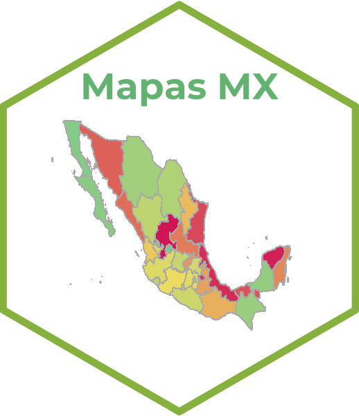

<!-- README.md is generated from README.Rmd. Please edit that file -->
<!-- badges: start -->

[](https://github.com/r-lib/usethis/actions/workflows/R-CMD-check.yaml)

<!-- badges: end -->

# Mapas por desagregaciones geográficas de México 

## Anotaciones

<!-- Anotaciones: end -->

Este repositorio puede ir cambiando, ya que se encuentra en versión de
control y esta es la primera versión.

## Instalación previa

Es necesario contar con el paquete **rmarkdown** dentro de [RStudio
IDE](https://www.rstudio.com/products/rstudio/download), pero no
necesita instalarlo explícitamente o bien cargarlo, ya que RStudio hace
ambas cosas automáticamente cuando es necesario. También se requiere una
versión reciente de Pandoc (\>= 3.1.11); RStudio también incluye esto
automáticamente, por lo que no se necesita descargar Pandoc si planea
usar rmarkdown desde el IDE de RStudio.

``` r
install.packages("rmarkdown")
```

# Repositorio de Mapas en `R`

### Mapas por desagregaciones geográficas de México

El primer documento se utilizan diferentes paqueterías en el entorno de
R, la cual se toman los diferentes niveles de desagregación en México.
Tomando como base a el índice de marginación 2020.

| Niveles de desagregación |
|:------------------------:|
|    Entidad Federativa    |
|        Municipio         |
|        Localidad         |
|           AGEB           |

**Enlace:**
<https://dvillasanao.github.io/Mapas_R/R/01_Mapas%20por%20desagregaciones%20geograficas%20de%20Mexico.nb.html>

<html>
<body>
<a href = "https://dvillasanao.github.io/Mapas_R/R/01_Mapas%20por%20desagregaciones%20geograficas%20de%20Mexico.nb.html" target="_blank">
 </a>
</body>
</html>

### Manejo de diferentes datos en formato `JSON`

#### `GeoJSON`

Los archivos
[GeoJSON](https://enterprise.arcgis.com/es/portal/latest/use/geojson.htm)
son archivos de texto que almacenan datos geoespaciales en el formato de
intercambio GeoJSON. Estos archivos se utilizan para representar
entidades geográficas, como puntos, líneas y polígonos, junto con sus
atributos no espaciales (metadatos). Cada entidad geográfica en un
archivo GeoJSON se describe utilizando la sintaxis `JSON` (JavaScript
Object Notation), donde se emplean el Sistema Geodésico Mundial de 1984
(WGS84) como su sistema de referencia de coordenadas y utiliza grados
decimales como unidades.

#### IMx2020 (Nivel entidad federativa, 2010 - 2020)

**Enlace:**
<https://dvillasanao.github.io/Mapas_R/docs/01.01_Leaflet-por-a%C3%B1o-2010_2020--GeoJSON-.html>

<html>
<body>
<a href="https://dvillasanao.github.io/Mapas_R/docs/01.01_Leaflet-por-a%C3%B1o-2010_2020--GeoJSON-.html" target="_blank">
 </a>
</body>
</html>

#### IMx2020 (Nivel entidad federativa desagregado por grado de marginación, 2010 - 2020)

**Enlace:**
<https://dvillasanao.github.io/Mapas_R/docs/01.02_Leaflet-por-año-y-grado-de-marginacion--GeoJSON-.html>

<html>
<body>
<a href="https://dvillasanao.github.io/Mapas_R/docs/01.02_Leaflet-por-año-y-grado-de-marginacion--GeoJSON-.html" target="_blank">
 </a>
</body>
</html>

#### `RMapshaper`

`RMapshaper` es un paquete que proporciona una interfaz para la
biblioteca JavaScript **mapshaper**, que se utiliza para simplificar,
transformar y analizar datos geoespaciales. Este paquete es
especialmente útil para trabajar con archivos GeoJSON, Shapefiles y
otros formatos de datos espaciales, reduciendo el tamaño del archivo y
la complejidad de las geometrías, lo que puede mejorar el rendimiento en
aplicaciones web y análisis.

#### IMx2020 (RMapshaper)

**Enlace:**
<https://dvillasanao.github.io/Mapas_R/docs/01.03_Leaflet-por-año-y-grado-de-marginacion--RMapshaper-.html>

<html>
<body>
<a href="https://dvillasanao.github.io/Mapas_R/docs/01.03_Leaflet-por-año-y-grado-de-marginacion--RMapshaper-.html" target="_blank">
 </a>
</body>
</html>
