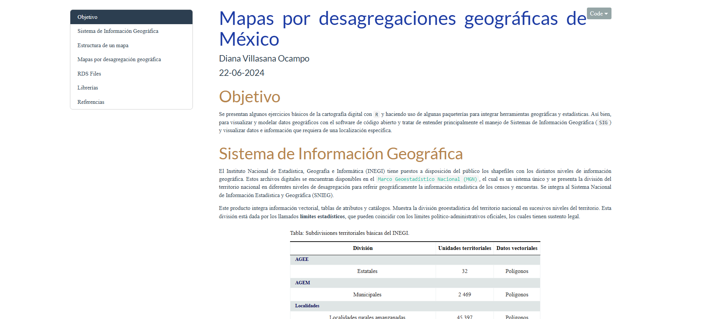

<!-- README.md is generated from README.Rmd. Please edit that file -->
<!-- badges: start -->

<!-- badges: end -->

# Repositorio de Mapas en `R`

### Mapas por desagregaciones geográficas de México

El primer documento se utilizan diferentes paqueterías en el entorno de
R, la cual se toman los diferentes niveles de desagregación en México.
Tomando como base a el índice de marginación 2020.

| Niveles de desagregación |
|:------------------------:|
|    Entidad Federativa    |
|        Municipio         |
|        Localidad         |
|           AGEB           |

**Enlace:**
<https://dvillasanao.github.io/Mapas_R/R/01_Mapas%20por%20desagregaciones%20geograficas%20de%20Mexico.nb.html>

<html>
<body>

</body>
</html>
